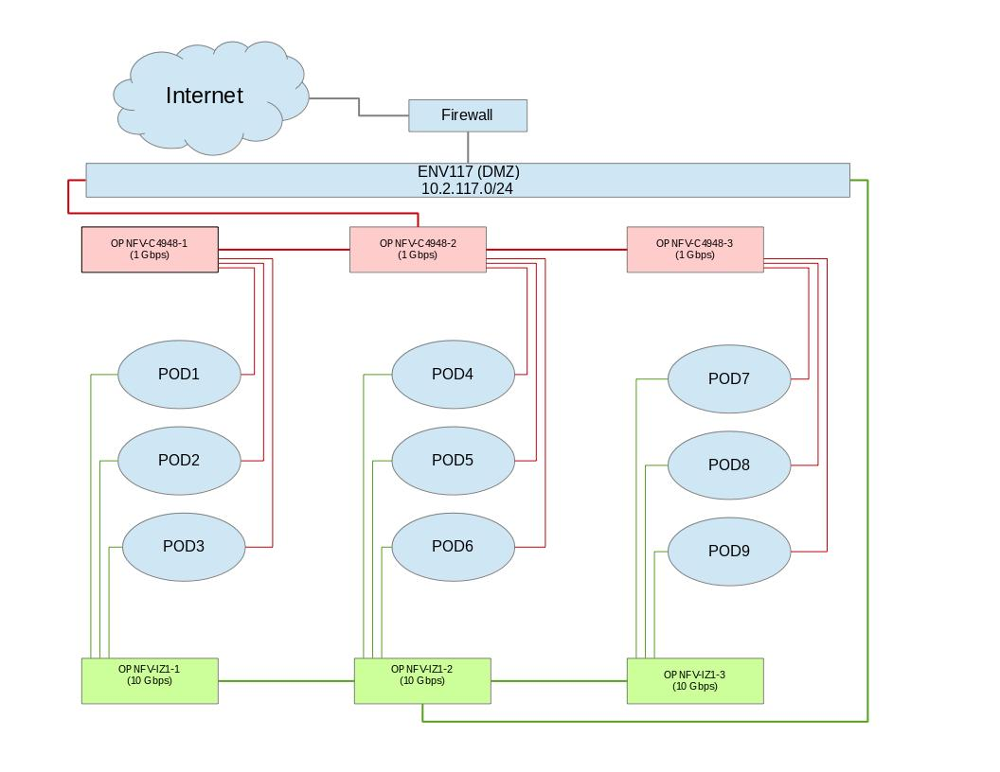

.. This work is licensed under a Creative Commons Attribution 4.0 International License.
.. http://creativecommons.org/licenses/by/4.0
.. (c) 2016 OPNFV.

.. _pharos_lab:

**************************
Lab Specification Template
**************************

Introduction
------------

Add an summary of what your lab hosts, its focus areas and purpose

Lab Resources
-------------

+----------+--------------+-----------------+--------------+-------------+---------+-------+
| POD Name | Project(s)   | Project Lead(s) | Email(s)     |  POD Role   |  Status | Notes |
+----------+--------------+-----------------+--------------+-------------+---------+-------+
| POD1     | Project Name | John Doe        | john@abc.com |  CI: stable |  Active |       |
+----------+--------------+-----------------+--------------+-------------+---------+-------+

* **POD Name:** Use consistent naming / numbering to avoid confusion. Hyperlinked to POD description.
* **POD Role:** CI stable, CI latest, Dev/test, Stand-alone, Virtual, ...
* **Status:** Assigned, Configuring, Active, Troubleshooting, Available, ...

Acceptable Usage Policy
-----------------------

Define lab user policies and expectations

Remote Access Infrastructure
----------------------------

Describe lab remote access setup (typically VPN, also link speed, any known restrictions, etc.)

Remote Access Procedure
-----------------------

Define lab process for requesting access to the lab (e.g. VPN guide,
how to modify BIOS settings, etc.)

Lab Documentation
-----------------

List lab specific documents here

Lab Topology
------------

Provide a diagram showing the network topology of lab including lights-out network. Any security
sensitive details should not be exposed publically. The following diagram is an example only.

