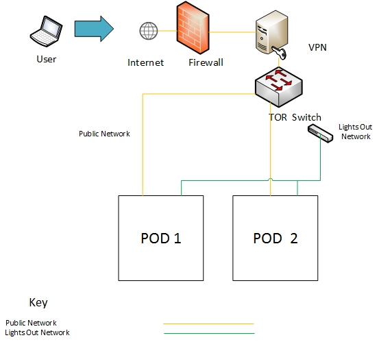
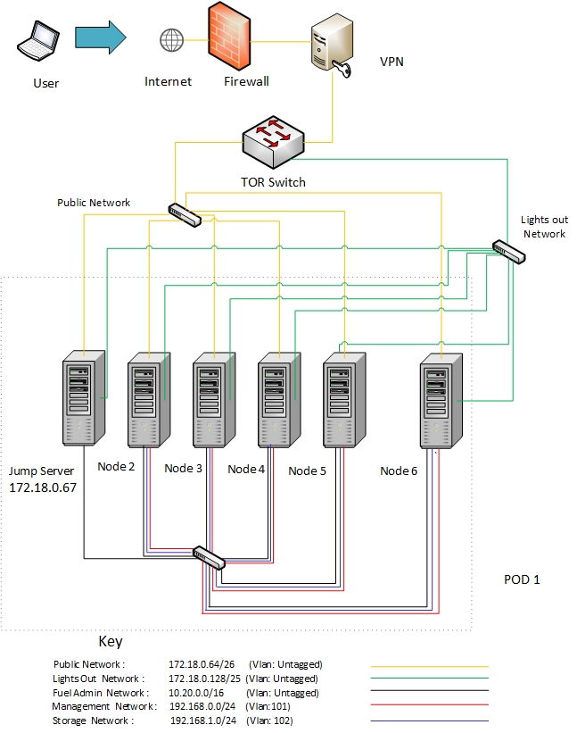
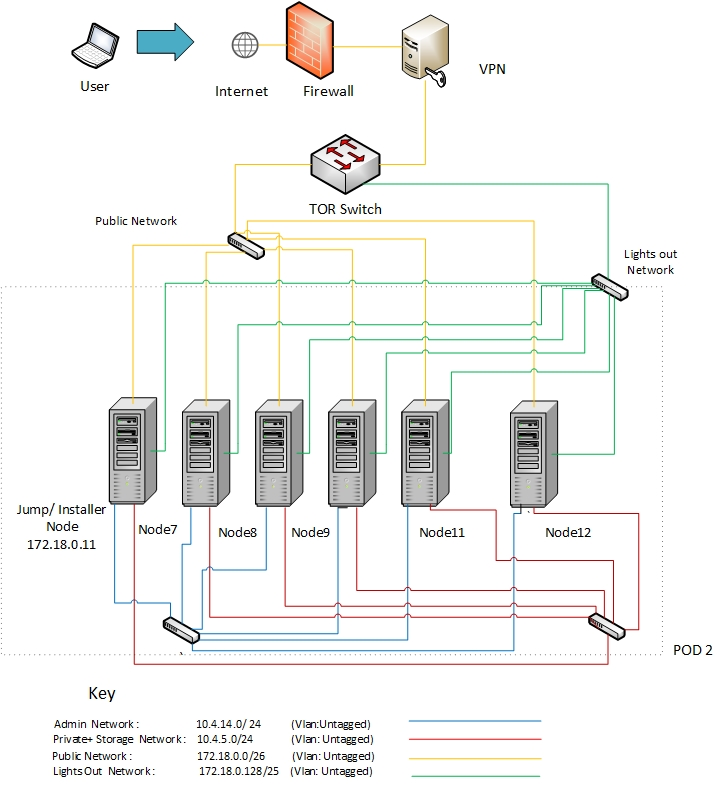

Dell OPNFV Testlab
==================================================

Overview
------------------

Dell is hosting an OPNFV testlab at its Santa Clara facility.
The testlab would host baremetal servers for the use of OPNFV community as part of the OPNFV Pharos Project.

The Dell Testlab consists of 2 PODs
    * POD1 for Fuel
    * POD2 for Foreman

Each of the 2 PODs consists of 6 servers that consist of
    * 1 Jump Server
    * 3 Servers for Control Nodes
    * 2 Servers for Compute Nodes

Hardware details
-----------------

**POD1-Fuel**

The specifications for the servers within POD1 can be found below:

+---------------------+---------------------+----------------+--------------+---------------------+------------+
| Hostname            |  Model              |    Memory      | Storage      | Processor           | Socket     |
+---------------------+---------------------+----------------+--------------+---------------------+------------+
|Fuel Jump Server     |  Dell PowerEdge M620| 64 GB          |600GB HDD     |Intel  Xeon E5-2640  |   2        |
+---------------------+---------------------+----------------+--------------+---------------------+------------+
|Node2                |  Dell PowerEdge M620| 64 GB          |600GB HDD     |Intel  Xeon E5-2640  |   2        |
+---------------------+---------------------+----------------+--------------+---------------------+------------+
|Node3                |  Dell PowerEdge M620| 64 GB          |600GB HDD     |Intel  Xeon E5-2640  |   2        |
+---------------------+---------------------+----------------+--------------+---------------------+------------+
|Node4                |  Dell PowerEdge M620| 64 GB          |600GB HDD     |Intel  Xeon E5-2640  |   2        |
+---------------------+---------------------+----------------+--------------+---------------------+------------+
|Node5                |  Dell PowerEdge M620| 64 GB          |600GB HDD     |Intel  Xeon E5-2640  |   2        |
+---------------------+---------------------+----------------+--------------+---------------------+------------+
|Node6                |  Dell PowerEdge M620| 64 GB          |600GB HDD     |Intel  Xeon E5-2640  |   2        |
+---------------------+---------------------+----------------+--------------+---------------------+------------+

The specifications for the Network Interfaces of servers within POD1 can be seen below:

+---------------------+----------------------------------------------+------+-------------------+-------+----------------------------------+
| Hostname            |  NIC Model                                   | Ports| MAC               | BW    | Roles                            |
+---------------------+----------------------------------------------+------+-------------------+-------+----------------------------------+
|Fuel Jump            |  1, Broadcom  NetXtreme II BCM57810          | em1  | A4:1F:72:11:B4:81 | 10G   | Unused                           |
|                     |                                              +------+-------------------+-------+----------------------------------+
|                     |                                              | em2  | A4:1F:72:11:B4:84 | 10G   | Unused                           |
|                     +----------------------------------------------+------+-------------------+-------+----------------------------------+
|                     |  2, Intel  82599                             | p3p1 | A4:1F:72:11:B4:85 | 10G   | Public                           |
|                     |                                              +------+-------------------+-------+----------------------------------+
|                     |                                              | p3p2 | A4:1F:72:11:B4:87 | 10G   | Fuel Admin/mgmt/pvt/ storage     |
|                     +----------------------------------------------+------+-------------------+-------+----------------------------------+
|                     |  3, Intel  82599                             | p1p1 | A4:1F:72:11:B4:89 | 10G   | Unused                           |
|                     |                                              +------+-------------------+-------+----------------------------------+
|                     |                                              | p1p2 | A4:1F:72:11:B4:8B | 10G   | Unused                           |
+---------------------+----------------------------------------------+------+-------------------+-------+----------------------------------+
|Node2                |  1, Broadcom  NetXtreme II BCM57810          | em1  | A4:1F:72:11:B4:8E | 10G   | Unused                           |
|                     |                                              +------+-------------------+-------+----------------------------------+
|                     |                                              | em2  | A4:1F:72:11:B4:91 | 10G   | Unused                           |
|                     +----------------------------------------------+------+-------------------+-------+----------------------------------+
|                     |  2, Intel  82599                             | p3p1 | A4:1F:72:11:B4:92 | 10G   | Public                           |
|                     |                                              +------+-------------------+-------+----------------------------------+
|                     |                                              | p3p2 | A4:1F:72:11:B4:94 | 10G   | Fuel Admin/mgmt/pvt/ storage     |
|                     +----------------------------------------------+------+-------------------+-------+----------------------------------+
|                     |  3, Intel  82599                             | p1p1 | A4:1F:72:11:B4:96 | 10G   | Unused                           |
|                     |                                              +------+-------------------+-------+----------------------------------+
|                     |                                              | p1p2 | A4:1F:72:11:B4:98 | 10G   | Unused                           |
+---------------------+----------------------------------------------+------+-------------------+-------+----------------------------------+
|Node3                |  1, Broadcom  NetXtreme II BCM57810          | em1  | A4:1F:72:11:B4:9B | 10G   | Unused                           |
|                     |                                              +------+-------------------+-------+----------------------------------+
|                     |                                              | em2  | A4:1F:72:11:B4:9E | 10G   | Unused                           |
|                     +----------------------------------------------+------+-------------------+-------+----------------------------------+
|                     |  2, Intel  82599                             | p3p1 | A4:1F:72:11:B4:9F | 10G   | Public                           |
|                     |                                              +------+-------------------+-------+----------------------------------+
|                     |                                              | p3p2 | A4:1F:72:11:B4:A1 | 10G   | Fuel Admin/mgmt/pvt/ storage     |
|                     +----------------------------------------------+------+-------------------+-------+----------------------------------+
|                     |  3, Intel  82599                             | p1p1 | A4:1F:72:11:B4:A3 | 10G   | Unused                           |
|                     |                                              +------+-------------------+-------+----------------------------------+
|                     |                                              | p1p2 | A4:1F:72:11:B4:A5 | 10G   | Unused                           |
+---------------------+----------------------------------------------+------+-------------------+-------+----------------------------------+
|Node4                |  1, Broadcom  NetXtreme II BCM57810          | em1  | A4:1F:72:11:B4:A8 | 10G   | Unused                           |
|                     |                                              +------+-------------------+-------+----------------------------------+
|                     |                                              | em2  | A4:1F:72:11:B4:AB | 10G   | Unused                           |
|                     +----------------------------------------------+------+-------------------+-------+----------------------------------+
|                     |  2, Intel  82599                             | p3p1 | A4:1F:72:11:B4:AC | 10G   | Public                           |
|                     |                                              +------+-------------------+-------+----------------------------------+
|                     |                                              | p3p2 | A4:1F:72:11:B4:AE | 10G   | Fuel Admin/mgmt/pvt/ storage     |
|                     +----------------------------------------------+------+-------------------+-------+----------------------------------+
|                     |  3, Intel  82599                             | p1p1 | A4:1F:72:11:B4:B0 | 10G   | Unused                           |
|                     |                                              +------+-------------------+-------+----------------------------------+
|                     |                                              | p1p2 | A4:1F:72:11:B4:B1 | 10G   | Unused                           |
+---------------------+----------------------------------------------+------+-------------------+-------+----------------------------------+
|Node5                |  1, Broadcom  NetXtreme II BCM57810          | em1  | A4:1F:72:11:B4:B5 | 10G   | Unused                           |
|                     |                                              +------+-------------------+-------+----------------------------------+
|                     |                                              | em2  | A4:1F:72:11:B4:B8 | 10G   | Unused                           |
|                     +----------------------------------------------+------+-------------------+-------+----------------------------------+
|                     |  2, Intel  82599                             | p3p1 | A4:1F:72:11:B4:B9 | 10G   | Public                           |
|                     |                                              +------+-------------------+-------+----------------------------------+
|                     |                                              | p3p2 | A4:1F:72:11:B4:BB | 10G   | Fuel Admin/mgmt/pvt/ storage     |
|                     +----------------------------------------------+------+-------------------+-------+----------------------------------+
|                     |  3, Broadcom  NetXtreme II BCM57810          | p1p1 | A4:1F:72:11:B4:BD | 10G   | Unused                           |
|                     |                                              +------+-------------------+-------+----------------------------------+
|                     |                                              | p1p2 | A4:1F:72:11:B4:C0 | 10G   | Unused                           |
+---------------------+----------------------------------------------+------+-------------------+-------+----------------------------------+
|Node6                |  1, Broadcom  NetXtreme II BCM57810          | em1  | A4:1F:72:11:B4:C2 | 10G   | Unused                           |
|                     |                                              +------+-------------------+-------+----------------------------------+
|                     |                                              | em2  | A4:1F:72:11:B4:C5 | 10G   | Unused                           |
|                     +----------------------------------------------+------+-------------------+-------+----------------------------------+
|                     |  2, Intel  82599                             | p3p1 | A4:1F:72:11:B4:C6 | 10G   | Public                           |
|                     |                                              +------+-------------------+-------+----------------------------------+
|                     |                                              | p3p2 | A4:1F:72:11:B4:C8 | 10G   | Fuel Admin/mgmt/pvt/ storage     |
|                     +----------------------------------------------+------+-------------------+-------+----------------------------------+
|                     |  3, Broadcom  NetXtreme II BCM57810          | p1p1 | A4:1F:72:11:B4:CA | 10G   | Unused                           |
|                     |                                              +------+-------------------+-------+----------------------------------+
|                     |                                              | p1p2 | A4:1F:72:11:B4:CD | 10G   | Unused                           |
+---------------------+----------------------------------------------+------+-------------------+-------+----------------------------------+

**POD2-Foreman**

The specifications for the servers within POD2 can be found below:
+---------------------+---------------------+----------------+--------------+---------------------+------------+
| Hostname            |  Model              |    Memory      | Storage      | Processor           | Socket     |
+---------------------+---------------------+----------------+--------------+---------------------+------------+
|Foreman Jump Server  |  Dell PowerEdge M620| 64 GB          |600GB HDD     |Intel  Xeon E5-2640  |   2        |
+---------------------+---------------------+----------------+--------------+---------------------+------------+
|Node7                |  Dell PowerEdge M620| 64 GB          |600GB HDD     |Intel  Xeon E5-2640  |   2        |
+---------------------+---------------------+----------------+--------------+---------------------+------------+
|Node8                |  Dell PowerEdge M620| 64 GB          |600GB HDD     |Intel  Xeon E5-2640  |   2        |
+---------------------+---------------------+----------------+--------------+---------------------+------------+
|Node9                |  Dell PowerEdge M620| 64 GB          |600GB HDD     |Intel  Xeon E5-2640  |   2        |
+---------------------+---------------------+----------------+--------------+---------------------+------------+
|Node11               |  Dell PowerEdge M620| 64 GB          |600GB HDD     |Intel  Xeon E5-2640  |   2        |
+---------------------+---------------------+----------------+--------------+---------------------+------------+
|Node12               |  Dell PowerEdge M620| 64 GB          |600GB HDD     |Intel  Xeon E5-2640  |   2        |
+---------------------+---------------------+----------------+--------------+---------------------+------------+

The specifications for the Network Interfaces of the servers within POD2 can be seen below:
+---------------------+----------------------------------------------+------+-----------------+-------+----------------------------------+
| Hostname            |  NIC Model                                   | Ports| MAC             | BW    | Roles                            |
+---------------------+----------------------------------------------+------+-----------------+-------+----------------------------------+
|Foreman Jump         |  1, Broadcom  NetXtreme II BCM57810          | em1  |A4:1F:72:11:B5:1D| 10G   | Foreman Admin                    |
|                     |                                              +------+-----------------+-------+----------------------------------+
|                     |                                              | em2  |A4:1F:72:11:B5:20| 10G   | Foreman Private/ Storage         |
|                     +----------------------------------------------+------+-----------------+-------+----------------------------------+
|                     |  2, Intel  82599                             | p3p1 |A4:1F:72:11:B5:21| 10G   | Public                           |
|                     |                                              +------+-----------------+-------+----------------------------------+
|                     |                                              | p3p2 |A4:1F:72:11:B5:23| 10G   | Unused                           |
|                     +----------------------------------------------+------+-----------------+-------+----------------------------------+
|                     |  3, TBD                                      | p1p1 |A4:1F:72:11:B4:89| 10G   | Unused                           |
|                     |                                              +------+-----------------+-------+----------------------------------+
|                     |                                              | p1p2 |A4:1F:72:11:B4:8B| 10G   | Unused                           |
+---------------------+----------------------------------------------+------+-----------------+-------+----------------------------------+
|Node7                |  1, Broadcom  NetXtreme II BCM57810          | em1  |A4:1F:72:11:B4:CF| 10G   | Foreman Admin                    |
|                     |                                              +------+-----------------+-------+----------------------------------+
|                     |                                              | em2  |A4:1F:72:11:B4:D2| 10G   | Foreman Private/ Storage         |
|                     +----------------------------------------------+------+-----------------+-------+----------------------------------+
|                     |  2, Intel  82599                             | p3p1 |A4:1F:72:11:B4:D3| 10G   | Public                           |
|                     |                                              +------+-----------------+-------+----------------------------------+
|                     |                                              | p3p2 |A4:1F:72:11:B4:D5| 10G   | Unused                           |
|                     +----------------------------------------------+------+-----------------+-------+----------------------------------+
|                     |  3,  Broadcom  NetXtreme II BCM57810         | p1p1 |A4:1F:72:11:B4:D7| 10G   | Unused                           |
|                     |                                              +------+-----------------+-------+----------------------------------+
|                     |                                              | p1p2 |A4:1F:72:11:B4:DA| 10G   | Unused                           |
+---------------------+----------------------------------------------+------+-----------------+-------+----------------------------------+
|Node8                |  1, Broadcom  NetXtreme II BCM57810          | em1  |A4:1F:72:11:B4:DC| 10G   | Foreman Admin                    |
|                     |                                              +------+-----------------+-------+----------------------------------+
|                     |                                              | em2  |A4:1F:72:11:B4:DF| 10G   | Foreman Private/ Storage         |
|                     +----------------------------------------------+------+-----------------+-------+----------------------------------+
|                     |  2, Intel  82599                             | p3p1 |A4:1F:72:11:B4:E0| 10G   | Public                           |
|                     |                                              +------+-----------------+-------+----------------------------------+
|                     |                                              | p3p2 |A4:1F:72:11:B4:E2| 10G   | Unused                           |
|                     +----------------------------------------------+------+-----------------+-------+----------------------------------+
|                     |  3, Broadcom  NetXtreme II BCM57810          | p1p1 |A4:1F:72:11:B4:E4| 10G   | Unused                           |
|                     |                                              +------+-----------------+-------+----------------------------------+
|                     |                                              | p1p2 |A4:1F:72:11:B4:E7| 10G   | Unused                           |
+---------------------+----------------------------------------------+------+-----------------+-------+----------------------------------+
|Node9                |  1, Broadcom  NetXtreme II BCM57810          | em1  |A4:1F:72:11:B4:E9| 10G   | Foreman Admin                    |
|                     |                                              +------+-----------------+-------+----------------------------------+
|                     |                                              | em2  |A4:1F:72:11:B4:EC| 10G   | Foreman Private/ Storage         |
|                     +----------------------------------------------+------+-----------------+-------+----------------------------------+
|                     |  2, Intel  82599                             | p3p1 |A4:1F:72:11:B4:ED| 10G   | Public                           |
|                     |                                              +------+-----------------+-------+----------------------------------+
|                     |                                              | p3p2 |A4:1F:72:11:B4:EF| 10G   | Unused                           |
|                     +----------------------------------------------+------+-----------------+-------+----------------------------------+
|                     |  3, Intel  82599                             | p1p1 |A4:1F:72:11:B4:F1| 10G   | Unused                           |
|                     |                                              +------+-----------------+-------+----------------------------------+
|                     |                                              | p1p2 |A4:1F:72:11:B4:F3| 10G   | Unused                           |
+---------------------+----------------------------------------------+------+-----------------+-------+----------------------------------+
|Node11               |  1, Broadcom  NetXtreme II BCM57810          | em1  |A4:1F:72:11:B5:03| 10G   | Foreman Admin                    |
|                     |                                              +------+-----------------+-------+----------------------------------+
|                     |                                              | em2  |A4:1F:72:11:B5:06| 10G   | Foreman Private/ Storage         |
|                     +----------------------------------------------+------+-----------------+-------+----------------------------------+
|                     |  2, Intel  82599                             | p3p1 |A4:1F:72:11:B5:07| 10G   | Public                           |
|                     |                                              +------+-----------------+-------+----------------------------------+
|                     |                                              | p3p2 |A4:1F:72:11:B5:09| 10G   | Unused                           |
|                     +----------------------------------------------+------+-----------------+-------+----------------------------------+
|                     |  3, Intel  82599                             | p1p1 |A4:1F:72:11:B5:0B| 10G   | Unused                           |
|                     |                                              +------+-----------------+-------+----------------------------------+
|                     |                                              | p1p2 |A4:1F:72:11:B5:0D| 10G   | Unused                           |
+---------------------+----------------------------------------------+------+-----------------+-------+----------------------------------+
|Node12               |  1, Broadcom  NetXtreme II BCM57810          | em1  |A4:1F:72:11:B5:10| 10G   | Foreman Admin                    |
|                     |                                              +------+-----------------+-------+----------------------------------+
|                     |                                              | em2  |A4:1F:72:11:B5:13| 10G   | Foreman Private/ Storage         |
|                     +----------------------------------------------+------+-----------------+-------+----------------------------------+
|                     |  2, Intel  82599                             | p3p1 |A4:1F:72:11:B5:14| 10G   | Public                           |
|                     |                                              +------+-----------------+-------+----------------------------------+
|                     |                                              | p3p2 |A4:1F:72:11:B5:16| 10G   | Unused                           |
|                     +----------------------------------------------+------+-----------------+-------+----------------------------------+
|                     |  3, TBD                                      | p1p1 |A4:1F:72:11:B4:89| 10G   | Unused                           |
|                     |                                              +------+-----------------+-------+----------------------------------+
|                     |                                              | p1p2 |A4:1F:72:11:B4:8B| 10G   | Unused                           |
+---------------------+----------------------------------------------+------+-----------------+-------+----------------------------------+

Software
---------

The Jump servers in the Testlab are pre-provisioned with the following software:

   * Fuel-Jump Server:
            1. OS: Ubuntu 14.04
            2. Preprovisoned softwares: KVM, VNC serve

   * Foreman-Jump Server:
            1. OS: Provisioned with CentOS7

Networks
----------

**POD1-Foreman Diagram**

**POD2-Foreman Diagram**

**Subnet allocations**

+-------------------+----------------+-------------------+---------------+----------+
| Network name      | Address        | Mask              | Gateway       | VLAN id  |
+-------------------+----------------+-------------------+---------------+----------+
| Foreman  Admin    | 10.4.14.0      |  255.255.255.0    | 10.4.14.100   | Untagged |
+-------------------+----------------+-------------------+---------------+----------+
| Foreman Private   | 10.4.5.0       |  255.255.255.0    | 10.4.5.1      | Untagged |
+-------------------+----------------+-------------------+---------------+----------+
| Public            | 172.18.0.0     |  255.255.255.0    | 172.18.0.1    | Untagged |
+-------------------+----------------+-------------------+---------------+----------+
|Fuel Admin         |10.20.0.0       |  255.255.0.0      | 10.20.0.1     | Untagged |
+-------------------+----------------+-------------------+---------------+----------+
|Fuel Mangement     |192.168.0.0     |  255.255.255.0    |192.168.0.1    | 101      |
+-------------------+----------------+-------------------+---------------+----------+
|Fuel Storage       |192.168.1.0     |  255.255.255.0    |192.168.1.1    | 102      |
+-------------------+----------------+-------------------+---------------+----------+

**Lights out Network**

**POD1**

+----------------+-------------------------------+------------------+---------------------+---------------------+
| Hostname       | Lights-out address            | MAC              |Username             | Password            |
+----------------+-------------------------------+------------------+---------------------+---------------------+
|Fuel-Jump       | 172.18.1.101                  |A4:1F:72:11:B4:80 |      root           |      calvin         |
+----------------+-------------------------------+------------------+---------------------+---------------------+
|Node2           | 172.18.1.102                  |A4:1F:72:11:B4:8D |      root           |      calvin         |
+----------------+-------------------------------+------------------+---------------------+---------------------+
|Node3           | 172.18.1.103                  |A4:1F:72:11:B4:9A |      root           |      calvin         |
+----------------+-------------------------------+------------------+---------------------+---------------------+
|Node4           | 172.18.1.104                  |A4:1F:72:11:B4:A7 |      root           |      calvin         |
+----------------+-------------------------------+------------------+---------------------+---------------------+
|Node5           | 172.18.1.105                  |A4:1F:72:11:B4:B4 |      root           |      calvin         |
+----------------+-------------------------------+------------------+---------------------+---------------------+
|Node6           | 172.18.1.106                  |A4:1F:72:11:B4:C1 |      root           |      calvin         |
+----------------+-------------------------------+------------------+---------------------+---------------------+

**POD2**

+----------------+-------------------------------+------------------+---------------------+---------------------+
| Hostname       | Lights-out address            | MAC              |Username             | Password            |
+----------------+-------------------------------+------------------+---------------------+---------------------+
|Foreman-Jump    | 172.18.1.113                  |A4:1F:72:11:B5:1C |      root           |      calvin         |
+----------------+-------------------------------+------------------+---------------------+---------------------+
|Node7           | 172.18.1.107                  |A4:1F:72:11:B4:CE |      root           |      calvin         |
+----------------+-------------------------------+------------------+---------------------+---------------------+
|Node8           | 172.18.1.108                  |A4:1F:72:11:B4:DB |      root           |      calvin         |
+----------------+-------------------------------+------------------+---------------------+---------------------+
|Node9           | 172.18.1.109                  |A4:1F:72:11:B4:E8 |      root           |      calvin         |
+----------------+-------------------------------+------------------+---------------------+---------------------+
|Node11          | 172.18.1.111                  |A4:1F:72:11:B5:02 |      root           |      calvin         |
+----------------+-------------------------------+------------------+---------------------+---------------------+
|Node12          | 172.18.1.112                  |A4:1F:72:11:B5:0F |      root           |      calvin         |
+----------------+-------------------------------+------------------+---------------------+---------------------+

Remote access infrastructure
-----------------------------

The Dell OPNFV testlab is free to use for the OPNFV community.

A VPN is used to provide access to the Dell Testlab.
Details can be found in *Dell OPNFV-lab Access* document (Attach link)

To access the Testlab, please contact Waqas_Riaz@DELL.com with the following details:
 * Name
 * Organization
 * Purpose of using the lab

 Processing the request can take 2-3 business days.

 **Accessing the Jump Server**

 The credentials for accessing the Jump servers are:

 *Fuel-Jump*

 User: opnfv
 password: d3ll1234

 *Foreman-Jump*

 User: root
 password: d3ll1234
