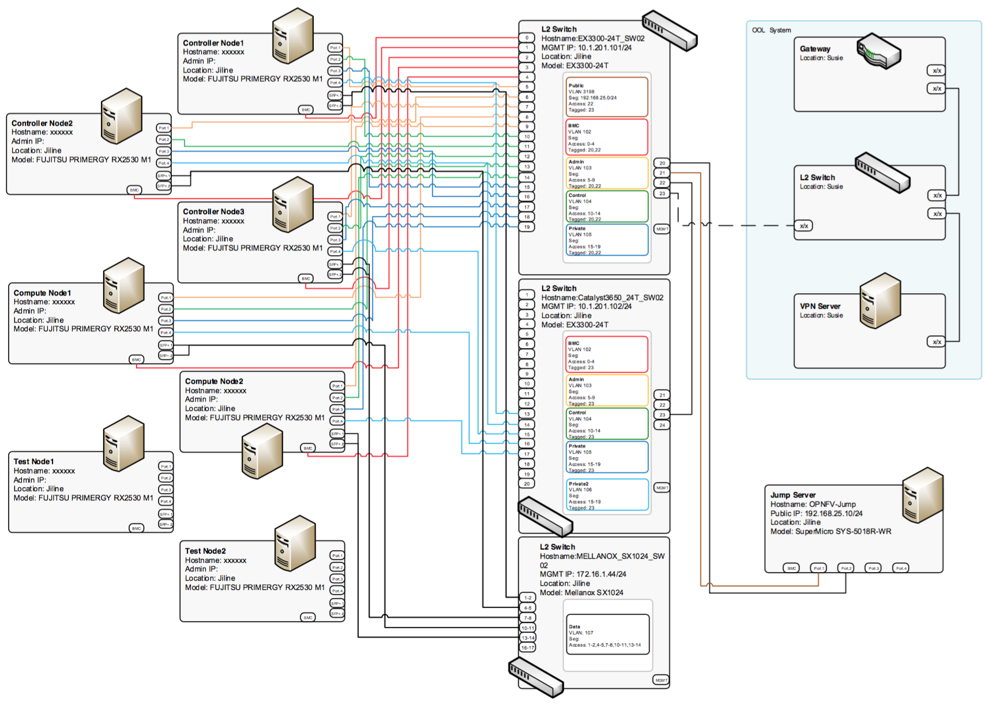

OOL (Okinawa Open Laboratory) OPNFV Testlab
==================================================

Overview
------------------
Okinawa Open Laboratory provides the following facilities for OPNFV testing.  The testlab is now
located only at Okinwa in Japan. ( We have plan to expand PODs and location.) The current depoyed
version by Fuel installer on the POD is Brahmputra.  It supports functest, yardstick projects
testing. You can connect to CI.  On each node an OPNFV solution will be installed based on Pharos
Lab project.  On top of this infrastructure several VNFs will be deployed.  We provide VPN(OpenVPN)
to connect the testlab.  You can check how to connect at “Access Procedure".

Environment
------------------
The test lab POD is setup along the Pharos project guidelines.
Servers are deployed in the the following configuration.

* 1 Jump server
* 3 Controller node
* 2 compute node

**Hardware Description**

* Summary

+----------------------------------------------+----------------------------+
| Node                                         | Machine                    |
+----------------------------------------------+----------------------------+
| Jump server                                  | SuperMicro SYS-5018R-WR    |
+----------------------------------------------+----------------------------+
| Controller & Compute Nodes                   | FUJITSU PRIMERGY RX2530 M1 |
+----------------------------------------------+----------------------------+
| Switching 1(for each network except storage) | Juniper EX3300-24T         |
+----------------------------------------------+----------------------------+
| Switching 2(for storage)                     | Mellanox SX1024            |
+----------------------------------------------+----------------------------+

* Machine Spec

+-------------------------+------------------+----+
| SuperMicro SYS-5018R-WR |                  |    |
+-------------------------+------------------+----+
| CPU                     | Xeon E5-2630v3   | x1 |
+-------------------------+------------------+----+
| RAM                     | 32GB             | -  |
+-------------------------+------------------+----+
| HDD                     | SATA 7.2krpm 2TB | x1 |
+-------------------------+------------------+----+
| SSD                     | -                | -  |
+-------------------------+------------------+----+
| 1000BASE-T              | Intel            | x2 |
+-------------------------+------------------+----+
| 10GBASE-T               | Inte             | x2 |
+-------------------------+------------------+----+
| BMC                     | -                | x1 |
+-------------------------+------------------+----+

+----------------------------+------------------+----+
| FUJITSU PRIMERGY RX2530 M1 |                  |    |
+----------------------------+------------------+----+
| CPU                        | Xeon E5-2630v3   | x1 |
+----------------------------+------------------+----+
| RAM                        | 32GB             | -  |
+----------------------------+------------------+----+
| HDD                        | SATA 7.2krpm 2TB | x2 |
+----------------------------+------------------+----+
| SSD                        | 100GB            | x1 |
+----------------------------+------------------+----+
| 1000BASE-T                 | Emulex Skyhawk   | x2 |
+----------------------------+------------------+----+
| 10GBASE-T                  | Intel            | x2 |
+----------------------------+------------------+----+
| BMC                        | -                | x1 |
+----------------------------+------------------+----+

---

**Network**

* Network Overview

* Server Nic

Heres are the specifications for the Network Interfaces of servers within POD.

+------------+-------------------------------------------+--------+-------------------+------+--------------------+
| Hostname   | NIC Model                                 | Ports  | MAC               | BW   | Role               |
+------------+-------------------------------------------+--------+-------------------+------+--------------------+
| OPNFV-Jump | Intel I350                                | em1    | 0c:c4:7a:6c:a2:b2 | 1Gb  | Public             |
+------------+-------------------------------------------+--------+-------------------+------+--------------------+
| OPNFV-Jump | Intel I350                                | em2    | 0c:c4:7a:6c:a2:b2 | 1Gb  | Admin/Mgmt/Private |
+------------+-------------------------------------------+--------+-------------------+------+--------------------+
| node-9     | Emulex OneConnect NIC (Skyhawk) (onboard) | eno1   | 90:1b:0e:6b:e8:a8 | 1Gb  | Admin              |
+------------+-------------------------------------------+--------+-------------------+------+--------------------+
| node-9     | Emulex OneConnect NIC (Skyhawk) (onboard) | eno2   | 90:1b:0e:6b:e8:a9 | 1Gb  | Mgmt               |
+------------+-------------------------------------------+--------+-------------------+------+--------------------+
| node-9     | Emulex OneConnect NIC (Skyhawk) (onboard) | eno3   | 90:1b:0e:6b:e8:aa | 1Gb  | Public             |
+------------+-------------------------------------------+--------+-------------------+------+--------------------+
| node-9     | Emulex OneConnect NIC (Skyhawk) (onboard) | eno4   | 90:1b:0e:6b:e8:ab | 1Gb  | Prvate             |
+------------+-------------------------------------------+--------+-------------------+------+--------------------+
| node-9     | Intel 82599ES                             | ens2f0 | 90:1b:0e:6d:09:71 | 10Gb | Storage            |
+------------+-------------------------------------------+--------+-------------------+------+--------------------+
| node-9     | Intel 82599ES                             | ens2f1 | 90:1b:0e:6d:09:72 | 10Gb | Storage            |
+------------+-------------------------------------------+--------+-------------------+------+--------------------+
| node-10    | Emulex OneConnect NIC (Skyhawk) (onboard) | eno1   | 90:1b:0e:6b:e3:00 | 1Gb  | Admin              |
+------------+-------------------------------------------+--------+-------------------+------+--------------------+
| node-10    | Emulex OneConnect NIC (Skyhawk) (onboard) | eno2   | 90:1b:0e:6b:e3:01 | 1Gb  | Mgmt               |
+------------+-------------------------------------------+--------+-------------------+------+--------------------+
| node-10    | Emulex OneConnect NIC (Skyhawk) (onboard) | eno3   | 90:1b:0e:6b:e3:02 | 1Gb  | Public             |
+------------+-------------------------------------------+--------+-------------------+------+--------------------+
| node-10    | Emulex OneConnect NIC (Skyhawk) (onboard) | eno4   | 90:1b:0e:6b:e3:03 | 1Gb  | Prvate             |
+------------+-------------------------------------------+--------+-------------------+------+--------------------+
| node-10    | Intel 82599ES                             | ens2f0 | 90:1b:0e:6d:09:5f | 10Gb | Storage            |
+------------+-------------------------------------------+--------+-------------------+------+--------------------+
| node-10    | Intel 82599ES                             | ens2f1 | 90:1b:0e:6d:09:60 | 10Gb | Storage            |
+------------+-------------------------------------------+--------+-------------------+------+--------------------+
| node-11    | Emulex OneConnect NIC (Skyhawk) (onboard) | eno1   | 90:1b:0e:6b:e5:b4 | 1Gb  | Admin              |
+------------+-------------------------------------------+--------+-------------------+------+--------------------+
| node-11    | Emulex OneConnect NIC (Skyhawk) (onboard) | eno2   | 90:1b:0e:6b:e5:b5 | 1Gb  | Mgmt               |
+------------+-------------------------------------------+--------+-------------------+------+--------------------+
| node-11    | Emulex OneConnect NIC (Skyhawk) (onboard) | eno3   | 90:1b:0e:6b:e5:b6 | 1Gb  | Public             |
+------------+-------------------------------------------+--------+-------------------+------+--------------------+
| node-11    | Emulex OneConnect NIC (Skyhawk) (onboard) | eno4   | 90:1b:0e:6b:e5:b7 | 1Gb  | Prvate             |
+------------+-------------------------------------------+--------+-------------------+------+--------------------+
| node-11    | Intel 82599ES                             | ens2f0 | 90:1b:0e:6d:09:6f | 10Gb | Storage            |
+------------+-------------------------------------------+--------+-------------------+------+--------------------+
| node-11    | Intel 82599ES                             | ens2f1 | 90:1b:0e:6d:09:70 | 10Gb | Storage            |
+------------+-------------------------------------------+--------+-------------------+------+--------------------+
| node-12    | Emulex OneConnect NIC (Skyhawk) (onboard) | eno1   | 90:1b:0e:6b:e2:bc | 1Gb  | Admin              |
+------------+-------------------------------------------+--------+-------------------+------+--------------------+
| node-12    | Emulex OneConnect NIC (Skyhawk) (onboard) | eno2   | 90:1b:0e:6b:e2:bd | 1Gb  | Mgmt               |
+------------+-------------------------------------------+--------+-------------------+------+--------------------+
| node-12    | Emulex OneConnect NIC (Skyhawk) (onboard) | eno3   | 90:1b:0e:6b:e2:be | 1Gb  | Public             |
+------------+-------------------------------------------+--------+-------------------+------+--------------------+
| node-12    | Emulex OneConnect NIC (Skyhawk) (onboard) | eno4   | 90:1b:0e:6b:e2:bf | 1Gb  | Prvate             |
+------------+-------------------------------------------+--------+-------------------+------+--------------------+
| node-12    | Intel 82599ES                             | ens2f0 | 90:1b:0e:6d:08:31 | 10Gb | Storage            |
+------------+-------------------------------------------+--------+-------------------+------+--------------------+
| node-12    | Intel 82599ES                             | ens2f1 | 90:1b:0e:6d:08:32 | 10Gb | Storage            |
+------------+-------------------------------------------+--------+-------------------+------+--------------------+

* Subnet Allocations

+----------------+---------------+---------------+----------------+----------+
| Network name   | Address       | Mask          | Gateway        | VLAN id  |
+----------------+---------------+---------------+----------------+----------+
| Public         | 192.168.25.0  | 255.255.255.0 | 192.168.25.254 | 103      |
+----------------+---------------+---------------+----------------+----------+
| Fuel Admin     | 192.168.103.0 | 255.255.255.0 | 192.168.103.1  | 103      |
+----------------+---------------+---------------+----------------+----------+
| Fuel Mangement | 192.168.104.0 | 255.255.255.0 | 192.168.104.1  | 104      |
+----------------+---------------+---------------+----------------+----------+
| Fuel Public    | 192.168.105.0 | 255.255.255.0 | 192.168.105.1  | 105      |
+----------------+---------------+---------------+----------------+----------+
| Fuel Private   | 192.168.106.0 | 255.255.255.0 |                | Untagged |
+----------------+---------------+---------------+----------------+----------+
| Fuel Storage   | 192.168.107.0 | 255.255.255.0 |                | Untagged |
+----------------+---------------+---------------+----------------+----------+

---

Access Procedure
------------------

This environment is free to use by any OPNFV contributor or committer for the purpose of OPNFV
approved activities. Access to this environment can be granted by sending a e-mail to: TBD

subject: opnfv_access_ool

Following information should be provided in the request:

* Full name
* e-mail
* Phone
* Organization
* Resources required
* How long is access needed
* PGP public key
* SSH public key

Granting access normally takes 2-3 business days.

Detailed access descriptions will be provided with your access grant e-mail
