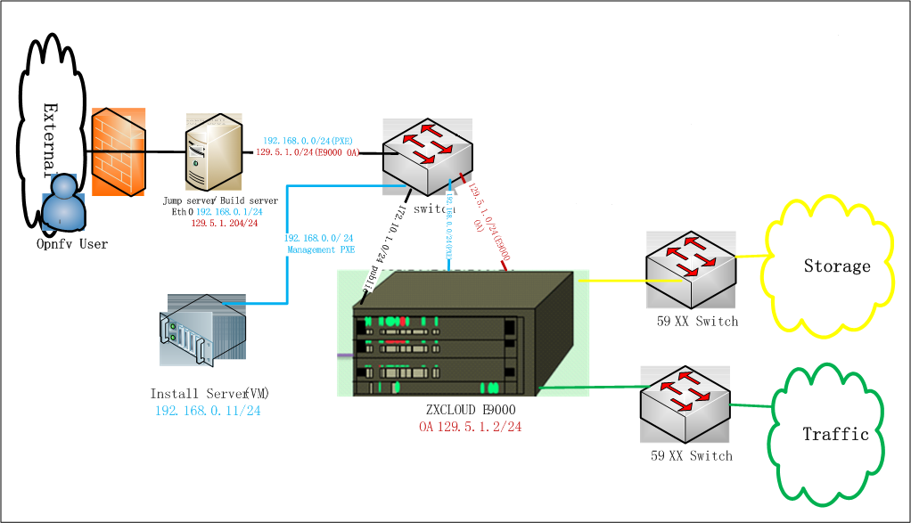

ZTE OPNFV Testlab
==================================================

Overview
------------------

ZTE is hosting an OPNFV testlab at Nanjing facility. The testlab would host baremetal servers for
the use of OPNFV community as part of the OPNFV Pharos Project.

The ZTE Testlab consists of 1 POD
    * POD for Fuel

The POD consists of 8 servers that consist of
    * 3 Servers for Control Nodes
    * 3 Servers for Compute Nodes
    * 2 Servers for spare

Hardware details
-----------------

**POD-Fuel**

The specifications for the servers within POD can be found below:

+------------------+------------+-----------+-----------+---------------------+--------+
| Hostname         |  Model     |    Memory | Storage   | Processor           | Socket |
+------------------+------------+-----------+-----------+---------------------+--------+
| Fuel Jump Server | ZTE R4300  | 32 GB     | 600GB HDD | Intel  Xeon E5-2680 |   2    |
+------------------+------------+-----------+-----------+---------------------+--------+
| Node4            | ZTE E9000  | 128 GB    | 600GB HDD | Intel  Xeon E5-2680 |   2    |
+------------------+------------+-----------+-----------+---------------------+--------+
| Node5            | ZTE E9000  | 128 GB    | 600GB HDD | Intel  Xeon E5-2680 |   2    |
+------------------+------------+-----------+-----------+---------------------+--------+
| Node6            | ZTE E9000  | 128 GB    | 600GB HDD | Intel  Xeon E5-2680 |   2    |
+------------------+------------+-----------+-----------+---------------------+--------+
| Node10           | ZTE E9000  | 128 GB    | 600GB HDD | Intel  Xeon E5-2680 |   2    |
+------------------+------------+-----------+-----------+---------------------+--------+
| Node11           | ZTE E9000  | 128 GB    | 600GB HDD | Intel  Xeon E5-2680 |   2    |
+------------------+------------+-----------+-----------+---------------------+--------+
| Node12           | ZTE E9000  | 128 GB    | 600GB HDD | Intel  Xeon E5-2680 |   2    |
+------------------+------------+-----------+-----------+---------------------+--------+
| Node13           | ZTE E9000  | 128 GB    | 600GB HDD | Intel  Xeon E5-2680 |   2    |
+------------------+------------+-----------+-----------+---------------------+--------+
| Node14           | ZTE E9000  | 128 GB    | 600GB HDD | Intel  Xeon E5-2680 |   2    |
+------------------+------------+-----------+-----------+---------------------+--------+

The specifications for the Network Interfaces of servers within POD can be seen below:

+-----------+-----------------------+----------+-------------------+-----+------------+
| Hostname  |  NIC Model            | Ports    | MAC               | BW  | Roles      |
+-----------+-----------------------+----------+-------------------+-----+------------+
| Fuel Jump |  1, RTL8111/8168/8411 | enp8s0   | 98:f5:37:e1:b4:1b | 10G | mgmt       |
+-----------+-----------------------+----------+-------------------+-----+------------+
|           |                       | enp9s0   | 98:f5:37:e1:b4:1c | 10G | Public     |
+-----------+-----------------------+----------+-------------------+-----+------------+
|           |  2, Inel 82599        | enp3s0f0 | 90:e2:ba:8b:08:64 | 10G | Unused     |
+-----------+-----------------------+----------+-------------------+-----+------------+
|           |                       | enp3s0f1 | 90:e2:ba:8b:08:65 | 10G | Unused     |
+-----------+-----------------------+----------+-------------------+-----+------------+
| Node10    |  1, Intel  82599      | eth0     | 4c:09:b4:b1:de:18 | 10G | Public     |
+-----------+-----------------------+----------+-------------------+-----+------------+
|           |                       | eth1     | 4c:09:b4:b1:de:19 | 10G | Public     |
+-----------+-----------------------+----------+-------------------+-----+------------+
|           |  2, Intel  82599      | eth2     | 4c:09:b4:b1:de:1a | 10G | storage    |
+-----------+-----------------------+----------+-------------------+-----+------------+
|           |                       | eth3     | 4c:09:b4:b1:de:1b | 10G | storage    |
+-----------+-----------------------+----------+-------------------+-----+------------+
|           |  3, Intel  I350       | eth4     | 4c:09:b4:b2:59:d8 | 10G | Admin/mgmt |
+-----------+-----------------------+----------+-------------------+-----+------------+
|           |                       | eth5     | 4c:09:b4:b2:59:d9 | 10G | Unused     |
+-----------+-----------------------+----------+-------------------+-----+------------+
| Node11    |  1, Intel  82599      | eth0     | 4c:09:b4:b1:de:3c | 10G | Public     |
+-----------+-----------------------+----------+-------------------+-----+------------+
|           |                       | eth1     | 4c:09:b4:b1:de:3d | 10G | Public     |
+-----------+-----------------------+----------+-------------------+-----+------------+
|           |  2, Intel  82599      | eth2     | 4c:09:b4:b1:de:3e | 10G | Storage    |
+-----------+-----------------------+----------+-------------------+-----+------------+
|           |                       | eth3     | 4c:09:b4:b1:de:3f | 10G | Storage    |
+-----------+-----------------------+----------+-------------------+-----+------------+
|           |  3, Intel  I350       | eth4     | 4c:09:b4:b2:5a:d4 | 10G | Admin/mgmt |
+-----------+-----------------------+----------+-------------------+-----+------------+
|           |                       | eth5     | 4c:09:b4:b2:5a:d5 | 10G | Unused     |
+-----------+-----------------------+----------+-------------------+-----+------------+
| Node12    |  1, Intel  82599      | eth0     | 4c:09:b4:b1:de:08 | 10G | Public     |
+-----------+-----------------------+----------+-------------------+-----+------------+
|           |                       | eth1     | 4c:09:b4:b1:de:09 | 10G | Public     |
+-----------+-----------------------+----------+-------------------+-----+------------+
|           |  2, Intel  82599      | eth2     | 4c:09:b4:b1:de:0a | 10G | storage    |
+-----------+-----------------------+----------+-------------------+-----+------------+
|           |                       | eth3     | 4c:09:b4:b1:de:0b | 10G | storage    |
+-----------+-----------------------+----------+-------------------+-----+------------+
|           |  3, Intel  I350       | eth4     | 4c:09:b4:b2:59:bd | 10G | Admin/mgmt |
+-----------+-----------------------+----------+-------------------+-----+------------+
|           |                       | eth5     | 4c:09:b4:b2:59:be | 10G | Unused     |
+-----------+-----------------------+----------+-------------------+-----+------------+
| Node4     |  1, Intel  82599      | eth0     | 4c:09:b4:b1:de:1c | 10G | Public     |
+-----------+-----------------------+----------+-------------------+-----+------------+
|           |                       | eth1     | 4c:09:b4:b1:de:1d | 10G | Public     |
+-----------+-----------------------+----------+-------------------+-----+------------+
|           |  2, Intel  82599      | eth2     | 4c:09:b4:b1:de:1e | 10G | storage    |
+-----------+-----------------------+----------+-------------------+-----+------------+
|           |                       | eth3     | 4c:09:b4:b1:de:1f | 10G | storage    |
+-----------+-----------------------+----------+-------------------+-----+------------+
|           |  3, Intel  I350       | eth4     | 4c:09:b4:b2:59:a2 | 10G | Admin/mgmt |
+-----------+-----------------------+----------+-------------------+-----+------------+
|           |                       | eth5     | 4c:09:b4:b2:59:a3 | 10G | Unused     |
+-----------+-----------------------+----------+-------------------+-----+------------+
| Node5     |  1, Intel  82599      | eth0     | 4c:09:b4:b1:de:24 | 10G | Public     |
+-----------+-----------------------+----------+-------------------+-----+------------+
|           |                       | eth1     | 4c:09:b4:b1:de:25 | 10G | Public     |
+-----------+-----------------------+----------+-------------------+-----+------------+
|           |  2, Intel  82599      | eth2     | 4c:09:b4:b1:de:26 | 10G | storage    |
+-----------+-----------------------+----------+-------------------+-----+------------+
|           |                       | eth3     | 4c:09:b4:b1:de:27 | 10G | storage    |
+-----------+-----------------------+----------+-------------------+-----+------------+
|           |  3, Intel  I350       | eth4     | 4c:09:b4:b2:59:ab | 10G | Admin/mgmt |
+-----------+-----------------------+----------+-------------------+-----+------------+
|           |                       | eth5     | 4c:09:b4:b2:59:ac | 10G | Unused     |
+-----------+-----------------------+----------+-------------------+-----+------------+
| Node6     |  1, Intel  82599      | eth0     | 4c:09:b4:b1:de:40 | 10G | Public     |
+-----------+-----------------------+----------+-------------------+-----+------------+
|           |                       | eth1     | 4c:09:b4:b1:de:41 | 10G | Public     |
+-----------+-----------------------+----------+-------------------+-----+------------+
|           |  2, Intel  82599      | eth2     | 4c:09:b4:b1:de:42 | 10G | storage    |
+-----------+-----------------------+----------+-------------------+-----+------------+
|           |                       | eth3     | 4c:09:b4:b1:de:43 | 10G | storage    |
+-----------+-----------------------+----------+-------------------+-----+------------+
|           |  3, Intel  I350       | eth4     | 4c:09:b4:b2:59:fc | 10G | Admin/mgmt |
+-----------+-----------------------+----------+-------------------+-----+------------+
|           |                       | eth5     | 4c:09:b4:b2:59:fd | 10G | Unused     |
+-----------+-----------------------+----------+-------------------+-----+------------+
| Node13    |  1, Intel  82599      | eth0     | 4c:09:b4:b1:de:38 | 10G | Public     |
+-----------+-----------------------+----------+-------------------+-----+------------+
|           |                       | eth1     | 4c:09:b4:b1:de:39 | 10G | Unused     |
+-----------+-----------------------+----------+-------------------+-----+------------+
|           |  2, Intel  82599      | eth2     | 4c:09:b4:b1:de:3a | 10G | storage    |
+-----------+-----------------------+----------+-------------------+-----+------------+
|           |                       | eth3     | 4c:09:b4:b1:de:3b | 10G | storage    |
+-----------+-----------------------+----------+-------------------+-----+------------+
|           |  3, Intel  I350       | eth4     | 4c:09:b4:b2:59:87 | 10G | Admin/mgmt |
+-----------+-----------------------+----------+-------------------+-----+------------+
|           |                       | eth5     | 4c:09:b4:b2:59:88 | 10G | Unused     |
+-----------+-----------------------+----------+-------------------+-----+------------+
| Node14    |  1, Intel  82599      | eth0     | 4c:09:b4:b1:de:48 | 10G | Public     |
+-----------+-----------------------+----------+-------------------+-----+------------+
|           |                       | eth1     | 4c:09:b4:b1:de:49 | 10G | Unused     |
+-----------+-----------------------+----------+-------------------+-----+------------+
|           |  2, Intel  82599      | eth2     | 4c:09:b4:b1:de:4a | 10G | storage    |
+-----------+-----------------------+----------+-------------------+-----+------------+
|           |                       | eth3     | 4c:09:b4:b1:de:4b | 10G | storage    |
+-----------+-----------------------+----------+-------------------+-----+------------+
|           |  3, Intel  I350       | eth4     | 4c:09:b4:b2:59:75 | 10G | Admin/mgmt |
+-----------+-----------------------+----------+-------------------+-----+------------+
|           |                       | eth5     | 4c:09:b4:b2:59:76 | 10G | Unused     |
+-----------+-----------------------+----------+-------------------+-----+------------+

Software
---------

The Jump servers in the Testlab are pre-provisioned with the following software:

   * Fuel-Jump Server:
        1. OS: CentOS
        2. Preprovisoned softwares: KVM, VNC server

Networks
----------

**Subnet allocations**

+----------------+--------------+----------------+-------------+----------+
| Network name   | Address      | Mask           | Gateway     | VLAN id  |
+----------------+--------------+----------------+-------------+----------+
| Public         | 172.10.0.0   |  255.255.255.0 | 172.10.0.1  | Untagged |
+----------------+--------------+----------------+-------------+----------+
| Fuel Admin     | 192.168.0.0  |  255.255.255.0 | 192.168.0.1 | Untagged |
+----------------+--------------+----------------+-------------+----------+
| Fuel Mangement | 192.168.11.0 |  255.255.255.0 |             | 101      |
+----------------+--------------+----------------+-------------+----------+
| Fuel Storage   | 192.168.12.0 |  255.255.255.0 |             | 102      |
+----------------+--------------+----------------+-------------+----------+

**Lights out Network**

**POD**

All nodes can log in by jumpserver.

+-----------+-------------------------+-------------------+----------+----------+
| Hostname  | Lights-out address      | MAC               | Username | Password |
+-----------+-------------------------+-------------------+----------+----------+
| Fuel-Jump | 58.213.14.182:5902(ssh) | 90:e2:ba:8b:08:65 |  opnfv   |          |
+-----------+-------------------------+-------------------+----------+----------+
| Node4     | 192.168.0.7             | 06:9d:69:13:5f:45 |          |          |
+-----------+-------------------------+-------------------+----------+----------+
| Node5     | 192.168.0.8             | 32:9b:c4:da:10:4c |          |          |
+-----------+-------------------------+-------------------+----------+----------+
| Node6     | 192.168.0.6             | 46:18:c4:74:cf:40 |          |          |
+-----------+-------------------------+-------------------+----------+----------+
| Node10    | 192.168.0.4             | be:d0:49:d4:06:42 |          |          |
+-----------+-------------------------+-------------------+----------+----------+
| Node11    | 192.168.0.3             | a2:d5:c1:bb:2b:49 |          |          |
+-----------+-------------------------+-------------------+----------+----------+
| Node12    | 192.168.0.2             | 62:08:00:cd:4c:43 |          |          |
+-----------+-------------------------+-------------------+----------+----------+
| Node13    | 192.168.0.9             | 4c:09:b4:b2:59:87 |          |          |
+-----------+-------------------------+-------------------+----------+----------+
| Node14    | 192.168.0.10            | 9a:90:8a:db:e1:4c |          |          |
+-----------+-------------------------+-------------------+----------+----------+

Remote access infrastructure
-----------------------------

The ZTE OPNFV testlab is free to use for the OPNFV community.

A VPN is used to provide access to the ZTE Testlab. Details can be found in *ZTE OPNFV-lab Access*
document (Attach link)

To access the Testlab, please contact Zhihui Wu(wu.zhihui1@zte.com.cn) with the following details:
 * Name
 * Organization
 * Purpose of using the lab

 Processing the request can take 2-3 business days.

 **Accessing the Jump Server**

 The credentials for accessing the Jump Server, please contact Zhihui Wu(wu.zhihui1@zte.com.cn).
