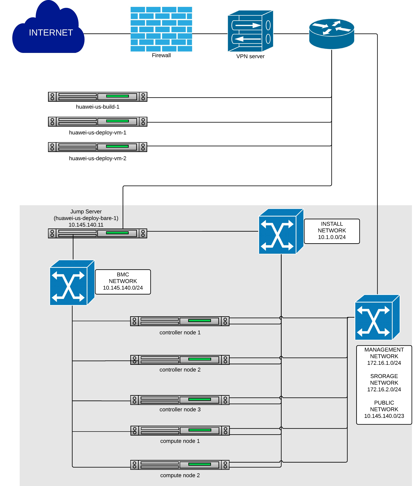
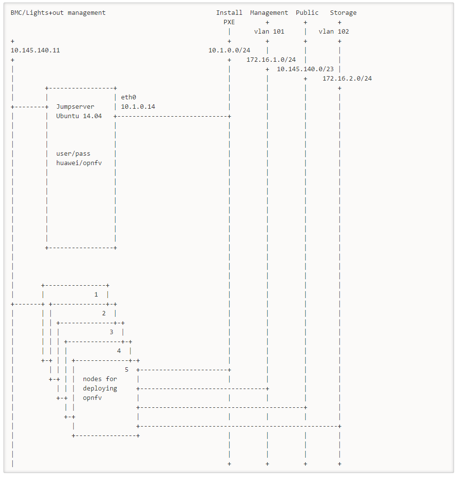

.. image:: ../etc/opnfv-logo.png
  :height: 40
  :width: 200
  :alt: OPNFV
  :align: left

|
|
Introduction
============

Huawei's lab located in Santa Clara, CA will provide 1 full POD for baremetal deployment environment, 2 standalone server for virtual deployment, and 1 server with 6 executors for project's building and gate-testing.
All the resources have been attached to jenkins master, you can view the slaves below in [[https://build.opnfv.org/ci/|jenkins master]]:

* huawei-us-build-1
* huawei-us-deploy-vm-1
* huawei-us-deploy-vm-2
* huawei-us-deploy-bare-1

  
Overall Description
===================

Hardware
--------

* 9 Huawei RH2285H V2 Rack Servers (128 GB RAM , 4.7 TB SATA SSDs, two Intel® Xeon® E5-2400 v2 series processors)
* 1 Huawei S9300 10G switch for storage, managment and public traffic - 2x10GE to each server.
* 1 Huawei S5300 1G switch for installing and Lights+out management traffic - 2x1GE to each server.
* 1 VPN concentrator for remote access and management.
* 1 Huawei firewall and router for public network secure access.

Hosting Topology
----------------

|
|
Figure 1: Huawei US lab OPNFV hosting environment overview

POD Network
-----------
Below you'll find a topological view of the hosting set-up:

|
|
Figure 1: Huawei US lab OPNFV hosting environment overview

How to use our resources?
=========================

**Build Resource**
You can see the slaves named "huawei-us-build-[digit]" or "huawei-build-[digit]" in [[https://build.opnfv.org/ci/|jenkins master]]

These resources are dedicated to CI. If you want to use huawei resource to run some automated jobs, you donnot need to apply for the credentials, just specify the node as "huawei-build" . For other purposes, please contact: [[weidong.shao@huawei.com]]

**Deployment Resource**
You can see the slaves named "huawei-us-deploy-vm/bare-[digit]" or "huawei-deploy-vm/bare-[digit]" in [[https://build.opnfv.org/ci/|jenkins master]]

We have two types of deployment resources, virtual deployment environment and baremetal deployment environment. Both can be deployed by any types of installer, and provide the same testbed for testing and the same infrastructure for VNF.

You can access our deployment resources by applying for the VPN credentials, please see the section below for details.

Access
======

This environment is free to use by any OPNFV contributor or committer for the purpose of OPNFV approved activities, you just need to obtain VPN credentials to access.

Access to this environment can be granted by sending a e-mail to:
  * [[weidong.shao@huawei.com]]
  * [[opnfv-helpdesk@rt.linuxfoundation.org]]

Following information should be provided in the request:
  * subject: opnfv_huawei_access
  * Full name
  * e-mail
  * Phone
  * Organization
  * OPNFV Contributor/Committer name :
  * OPNFV Project(s) Association:
  * LF ID:
  * Recommended by:
  * PGP public key (preferably registered with a PGP PKI server)
  * SSH public key

Granting access normally takes 3-5 business days.

Revision: _sha1_

Build date: |today|