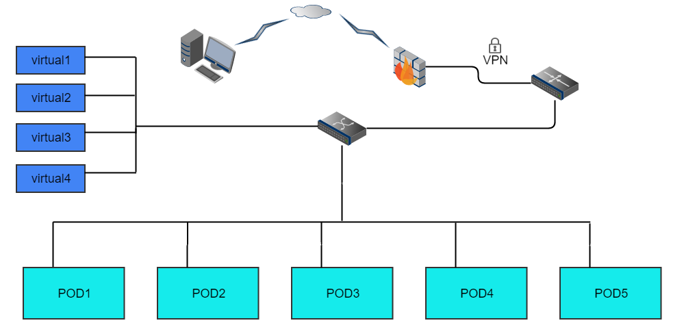

.. This work is licensed under a Creative Commons Attribution 4.0 International License.
.. http://creativecommons.org/licenses/by/4.0

**************************
Huawei's Lab Specification
**************************

Introduction
------------

Huawei's lab providing 5 PODs for baremetal deployment, 4 standalone servers
for virtual deployment. All the resources have been attached to jenkins master,
you can view the slaves below in jenkins master. Current POD assignments and
individual POD details are listed below.

Lab Resources & Assignments
^^^^^^^^^^^^^^^^^^^^^^^^^^^

+-----------------+-------------+-----------+--------+
| Resource        | Project(s)  | POD Role  | Status |
+-----------------+-------------+-----------+--------+
| huawei-pod1     | compass4nfv | CI Stable | Active |
+-----------------+-------------+-----------+--------+
| huawei-pod2     | compass4nfv | CI Stable | Active |
+-----------------+-------------+-----------+--------+
| huawei-pod3     | yardstick   | Dev/Test  | Active |
+-----------------+-------------+-----------+--------+
| huawei-pod4     | compass4nfv | CI Stable | Active |
+-----------------+-------------+-----------+--------+
| huawei-pod5     | compass4nfv | CI Stable | Active |
+-----------------+-------------+-----------+--------+
| huawei-virtual1 | compass4nfv | CI Stable | Active |
+-----------------+-------------+-----------+--------+
| huawei-virtual2 | compass4nfv | CI Stable | Active |
+-----------------+-------------+-----------+--------+
| huawei-virtual3 | compass4nfv | CI Stable | Active |
+-----------------+-------------+-----------+--------+
| huawei-virtual4 | compass4nfv | CI Stable | Active |
+-----------------+-------------+-----------+--------+

Acceptable Usage Policy
-----------------------

All of these resources above are used for OPNFV CI, if there is any requirement by OPNFV
contributor or committer for the purpose of OPNFV development, please apply to us for permission.

Remote Access Infrastructure
----------------------------

Huawei provides VPN(OpenVPN) to connect the lab.

Remote Access Procedure
-----------------------

This environment is free to use by any OPNFV contributor or committer for the
purpose of OPNFV approved activities, you just need to obtain VPN credentials to access.

Access to this environment can be granted by sending a e-mail to:
  * chigang@huawei.com
  * meimei@huawei.com

Following information should be provided in the request:

  * subject: opnfv_huawei_access
  * Full name
  * e-mail
  * Phone
  * Organization
  * OPNFV Contributor/Committer name :
  * OPNFV Project(s) Association:
  * LF ID:
  * Recommended by:
  * PGP public key (preferably registered with a PGP PKI server)
  * SSH public key

Granting access normally takes 3-5 business days.

Detailed access descriptions will be provided with your access grant e-mail.

Lab Documentation
-----------------

Lab Topology
------------

Below you'll find a topological view of the hosting set-up,you can get more
detailed information from the  individual POD.

|
|

Figure 1: Huawei lab OPNFV hosting environment overview
