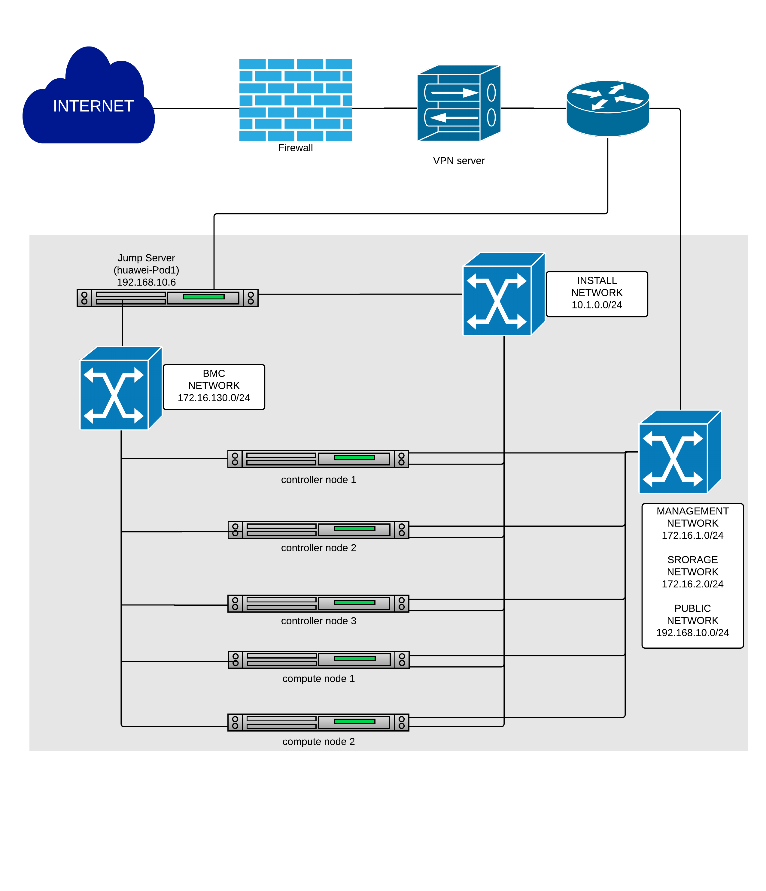
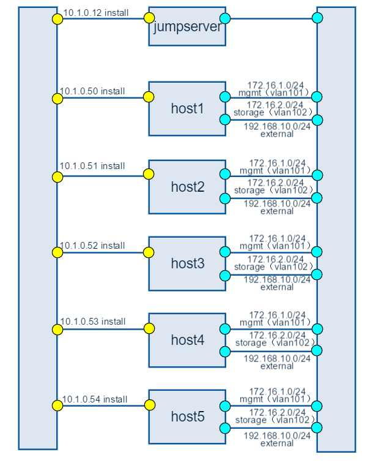
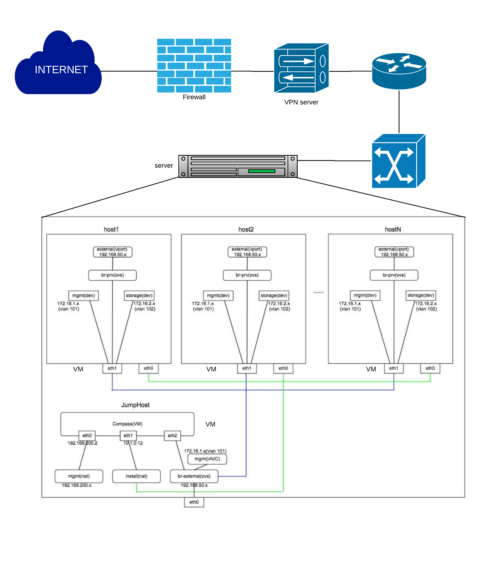

=========================
Huawei PODs Specification
=========================

NOTE: Illustrated by the example of huawei-pod1&huawei-virtual1.

huawei-pod1
===========

Introduction
------------

This is a bare metal deployment pod deployed by compass installer

Hardware
^^^^^^^^

* the pod1 consist of 6 Rack servers, the following is detail

+------------+-----------------------+---------+--------+-----------------------------+
| Hostname   | CPU                   | Storage | Memory | ipmi Mac &ip                |
+------------+-----------------------+---------+--------+-----------------------------+
| jumpserver | Intel(R) Xeon(R) CPU  |  1.8TB  |  31G   |                             |
|            | X5650  @ 2.67GHz      |         |        |                             |
+------------+-----------------------+---------+--------+-----------------------------+
| Host1      | Intel(R) Xeon(R) CPU  |  4.2TB  |  188G  | eth3:Mac F8:4A:BF:55:A2:8E  |
| controller | E5-2690 @ 2.90GHz     |         |        | ip 172.16.130.26            |
+------------+-----------------------+---------+--------+-----------------------------+
| Host2      | Intel(R) Xeon(R) CPU  |  6TB    |  188G  | eth3:Mac D8:49:0B:DA:5A:B8  |
| controller | E5-2670@ 2.60GHz      |         |        | ip 172.16.130.27            |
+------------+-----------------------+---------+--------+-----------------------------+
| Host3      | Intel(R) Xeon(R) CPU  |  8.4TB  |  188G  | eth3:Mac 78:D7:52:A0:B1:9D  |
| controller | E5-2670@ 2.60GHz      |         |        | ip 172.16.130.29            |
+------------+-----------------------+---------+--------+-----------------------------+
| Host4      | Intel(R) Xeon(R) CPU  |  7.2TB  |  188G  | eth3:Mac D8:49:0B:DA:5B:5E  |
| compute    | E5-2670@ 2.60GHz      |         |        | ip 172.16.130.30            |
+------------+-----------------------+---------+--------+-----------------------------+
| Host5      | Intel(R) Xeon(R) CPU  |  4.8TB  |  188G  | eth3:Mac D8:49:0B:DA:56:86  |
| compute    | E5-2670@ 2.60GHz      |         |        | ip 172.16.130.31            |
+------------+-----------------------+---------+--------+-----------------------------+

* 1 Huawei S9300 10G switch for storage, management and public traffic - 2x10GE to
  each server.
* 1 Huawei S5300 1G switch for installing and Lights+out management traffic - 2x1GE to
  each server.
* 1 VPN concentrator for remote access and management.
* 1 Huawei firewall and router for public network secure access.

huawei-pod1 Topology
--------------------

|
|

Figure 1: Huawei lab pod1 topology

huawei-pod1 Network
-------------------
Below you'll find a topological view of the huawei-Pod1 set-up:

|
|

Figure 2: Full Pod network configuration

huawei-virtual1
===============

Introduction
------------

This is a virtual deployment POD deployed  by compass installer

Hardware
^^^^^^^^
virtual pod consist of one standalone server

+-----------+----------------------+
| name      | huawei-virtual1      |
+-----------+----------------------+
| CPU       | Intel(R) Xeon(R) CPU |
|           | E5-2680 v3 @ 2.50GHz |
+-----------+----------------------+
| Memory    | 251G                 |
+-----------+----------------------+
| Storage   | 4TB                  |
+-----------+----------------------+
| IP        | 192.168.107.2        |
+-----------+----------------------+

Network
-------
Below you'll find a topological view of the huawei-virtual1 Pod set-up:

|
|

Figure 3: virtual deployment pod network configuration

