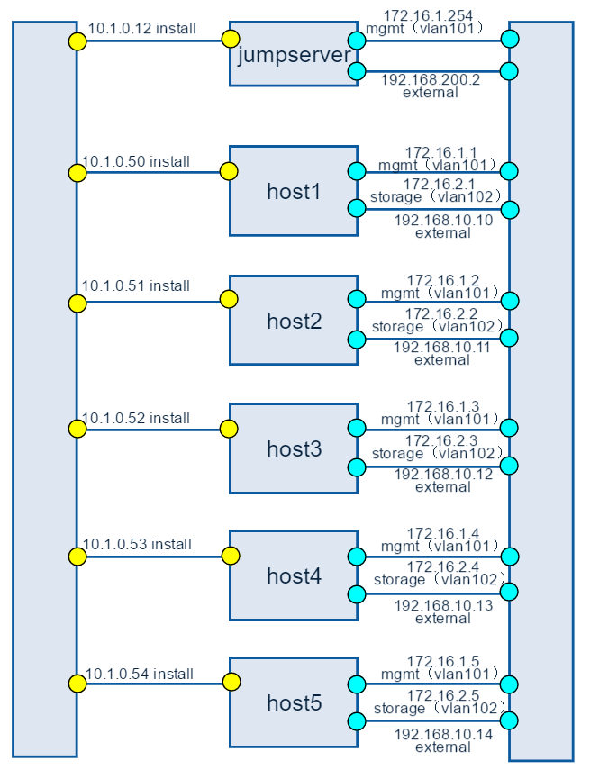
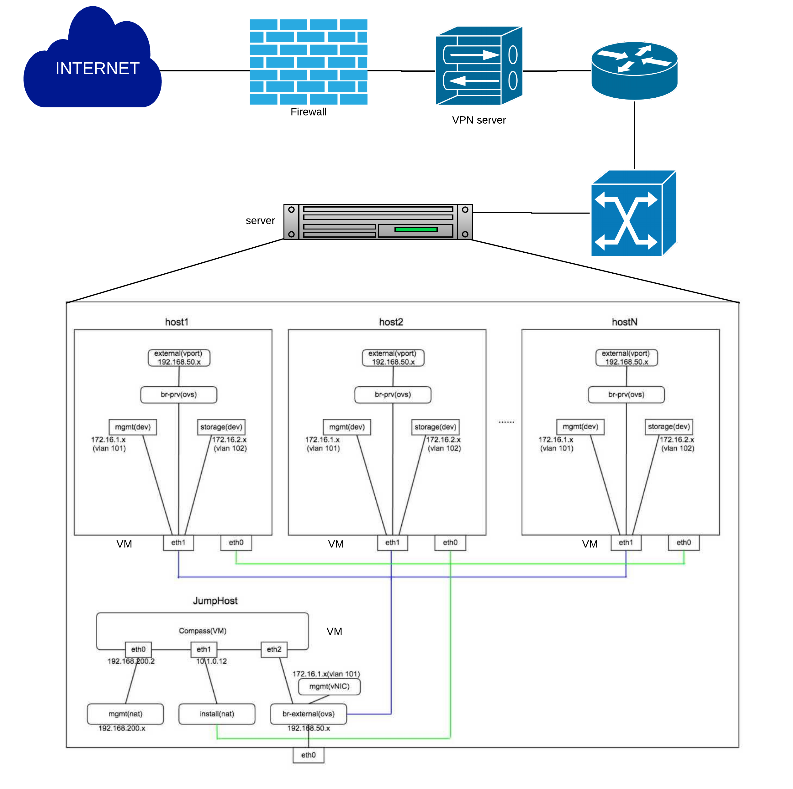

=====================================
Introduction the pods of Huawei's lab 
=====================================

Huawei-POD1
===========

Introduction
------------

This is a bare metal deployment POD deployed  by compass installer

Hardware
--------

* the POD1 consist of 6 Rack Servers, the fllowing is detail 

+----------------------------------+--------+--------+----------------------------+------------------------------------------+
|Hostname   |CPU                   | Storage| Memory | ipmi Mac &ip               |Mac&ip                                    |
+----------------------------------------------------------------------------------------------------------------------------+
|jumpserver |Intel(R) Xeon(R) CPU  |  1.8TB |  31G   |                            |eth1:Mac e0:24:7f:02:15:a4,IP 10.1.0.13   |
|           |X5650  @ 2.67GHz      |        |        |                            |eth2:Mac e0:24:7f:02:15:a3,IP 192.168.10.6|
+----------------------------------------------------------------------------------------------------------------------------+
|Host1      |Intel(R) Xeon(R) CPU  |  4.2TB |  188G  | eth3:Mac F8:4A:BF:55:A2:8E |eth0:Mac f8:4a:bf:55:a2:8d,IP 10.1.0.50   |
|controller |E5-2690 @ 2.90GHz     |        |        | ip 172.16.130.26           |eth1:Mac:f8:4a:bf:55:a2:8e,IP             |
+----------------------------------------------------------------------------------------------------------------------------+
|Host2      |Intel(R) Xeon(R) CPU  |  6TB   |  188G  | eth3:Mac D8:49:0B:DA:5A:B8 |eth0:Mac d8:49:0b:da:5a:b7IP10.1.0.5150   |
|controller |E5-2670@ 2.60GHz      |        |        | ip 172.16.130.27           |eth1:Mac d8:49:0b:da:5a:b8,IP             |
+----------------------------------------------------------------------------------------------------------------------------+
|Host3      |Intel(R) Xeon(R) CPU  |  8.4TB |  188G  | eth3:Mac 78:D7:52:A0:B1:9D |etho:Mac 78:d7:52:a0:b1:99,IP10.1.0.52    |
|controller |E5-2670@ 2.60GHz      |        |        | ip172.16.130.29            |eth1:Mac78:d7:52:a0:b1:9a,IP              |
+----------------------------------------------------------------------------------------------------------------------------+
|Host4      |Intel(R) Xeon(R) CPU  |  7.2TB |        | eth3:Mac D8:49:0B:DA:5B:5E |eth0:Mac d8:49:0b:da:5b:5d ,IP10.1.0.53   |
|compute    |E5-2670@ 2.60GHz      |        |  188G  | ip 172.16.130.30           |eth1:Mac d8:49:0b:da:5b:5e,IP             |
+----------------------------------------------------------------------------------------------------------------------------+
|Host5      |Intel(R) Xeon(R) CPU  |  4.8TB |  188G  | eth3:Mac D8:49:0B:DA:56:86 |eth0:Mac d8:49:0b:da:56:85,IP 10.1.0.54   |
|compute    |E5-2670@ 2.60GHz      |        |        | ip 172.16.130.31           |eth1:Mac d8:49:0b:da:56:86,IP             |
+----------------------------------+--------+--------+----------------------------+------------------------------------------+

* 1 Huawei S9300 10G switch for storage, management and public traffic - 2x10GE to
  each server.
* 1 Huawei S5300 1G switch for installing and Lights+out management traffic - 2x1GE to
  each server.
* 1 VPN concentrator for remote access and management.
* 1 Huawei firewall and router for public network secure access.

POD1 Topology
----------------

|
|

Figure 1: Huawei lab Pod1 topology

POD Network
-----------
Below you'll find a topological view of the huawei-Pod1 set-up:

|
|

Figure 2: Full Pod network configuration

install: 10.1.0.0/24
mgmt: 172.16.1.0/24
storage: 172.16.2.0/24
external: 192.168.10.0/24
internal_vip: 172.16.1.222
public_vip: 192.168.10.51

other physical Pods
===================

the other physical Pods in huawei lab is similar to Pod1, so you can konw other Pods
according pod1

huawei-virtual1
===============

Introduction
------------

This is a virtual deployment POD deployed  by compass installer

Hardware
--------
virtual pod consist of one standalone server
+-------------------------------+
|name      |huawei-virtual1     |
+-------------------------------+
|CPU       |Intel(R) Xeon(R) CPU|
|          |E5-2680 ^3 @ 2.50GHz|
+-------------------------------+
|Memory    |251G                |
+-------------------------------+
|Storage   |4TB                 |
+-------------------------------+
|IP        |192.168.107.2       |
+-------------------------------+

Network
-------
Below you'll find a topological view of the huawei-virtual1 Pod set-up:

|
|

Figure 2: Full Pod network configuration

install: 10.1.0.0/24
mgmt: 172.16.1.0/24
storage: 172.16.2.0/24
external: 192.168.10.0/24
internal_vip: 172.16.1.222
public_vip: 192.168.10.51

