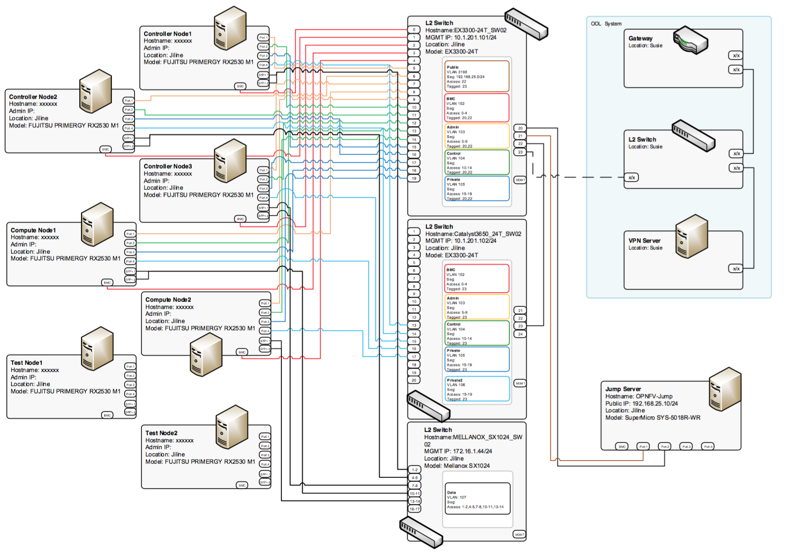

.. This work is licensed under a Creative Commons Attribution 4.0 International License.
.. http://creativecommons.org/licenses/by/4.0
.. (c) 2016 OPNFV.

*************
POD: ool-pod1
*************

Introduction
------------

This is a physical POD deployed by Fuel installer (Brahmputra).

Additional Requirements
-----------------------

.. _ool-pod1-spec:

Server Specifications
---------------------

**Jump Host**

+------------+------------+--------------+---------------+--------------+--------+---------------------+
| Hostname   | Vendor     | Model        | Serial Number | CPUs         | Memory | Storage             |
+============+============+==============+===============+==============+========+=====================+
| OPNFV-jump | SuperMicro | SYS-5018R-WR | -             | E5-2630v3 x1 | 32 GB  | SATA 7.2krpm 2TB x1 |
+------------+------------+--------------+---------------+--------------+--------+---------------------+

+------------+---------------------+--------------------+-------------------+------------+
|            | Lights-out network  | 1GbE: NIC#/IP      | 10GbE: NIC#/IP    |            |
| Hostname   | (IPMI): IP/MAC, U/P | MAC/VLAN/Network   | MAC/VLAN/Network  | Notes      |
+============+=====================+====================+===================+============+
| OPNFV-jump | -                   | IF0:               |                   | NIC Model: |
|            |                     | 0c:c4:7a:6c:a2:b2  |                   | Intel I350 |
|            |                     | VLAN untagged      |                   |            |
|            |                     | Public             |                   |            |
|            |                     | IF1:               |                   |            |
|            |                     | 0c:c4:7a:6c:a2:b3  |                   |            |
|            |                     | VLAN 10{2-5}       |                   |            |
|            |                     | Admin/Mgmt/Private |                   |            |
+------------+---------------------+--------------------+-------------------+------------+

**Compute Nodes**

+----------+------------+-----------+---------------+--------------+--------+---------------------+
| Hostname | Vendor     | Model     | Serial Number | CPUs         | Memory | Storage             |
+==========+============+===========+===============+==============+========+=====================+
| node-9   | FUJITSU    | RX2530 M1 | -             | E5-2630v3 x1 | 32 GB  | SATA 7.2krpm 2TB x2 |
|          |            |           |               |              |        | SSD 100GB x1        |
+----------+------------+-----------+---------------+--------------+--------+---------------------+
| node-10  | FUJITSU    | RX2530 M1 | -             | E5-2630v3 x1 | 32 GB  | SATA 7.2krpm 2TB x2 |
|          |            |           |               |              |        | SSD 100GB x1        |
+----------+------------+-----------+---------------+--------------+--------+---------------------+
| node-11  | FUJITSU    | RX2530 M1 | -             | E5-2630v3 x1 | 32 GB  | SATA 7.2krpm 2TB x2 |
|          |            |           |               |              |        | SSD 100GB x1        |
+----------+------------+-----------+---------------+--------------+--------+---------------------+
| node-12  | FUJITSU    | RX2530 M1 | -             | E5-2630v3 x1 | 32 GB  | SATA 7.2krpm 2TB x2 |
|          |            |           |               |              |        | SSD 100GB x1        |
+----------+------------+-----------+---------------+--------------+--------+---------------------+

+----------+---------------------+-------------------+-------------------+-----------------------+
|          | Lights-out network  | 1GbE: NIC#/IP     | 10GbE: NIC#/IP    |                       |
| Hostname | (IPMI): IP/MAC, U/P | MAC/VLAN/Network  | MAC/VLAN/Network  | Notes                 |
+==========+=====================+===================+===================+=======================+
| node-9   | -                   | IF0:              | IF4:              | NIC Models:           |
|          |                     | 90:1b:0e:6b:e8:a8 | 90:1b:0e:6d:09:71 | (1GbE) Emulex Skyhawk |
|          |                     | VLAN untagged     | VLAN untagged     | (10GbE) Intel 82599E  |
|          |                     | Admin             | Storage           |                       |
|          |                     | IF1:              | IF5:              |                       |
|          |                     | 90:1b:0e:6b:e8:a9 | 90:1b:0e:6d:09:72 |                       |
|          |                     | VLAN untagged     | VLAN untagged     |                       |
|          |                     | Mgmt              | Storage           |                       |
|          |                     | IF2:              |                   |                       |
|          |                     | 90:1b:0e:6b:e8:aa |                   |                       |
|          |                     | VLAN untagged     |                   |                       |
|          |                     | Public            |                   |                       |
|          |                     | IF3:              |                   |                       |
|          |                     | 90:1b:0e:6b:e8:ab |                   |                       |
|          |                     | VLAN untagged     |                   |                       |
|          |                     | Private           |                   |                       |
+----------+---------------------+-------------------+-------------------+-----------------------+
| node-10  | -                   | IF0:              | IF4:              | NIC Models:           |
|          |                     | 90:1b:0e:6b:e3:00 | 90:1b:0e:6d:09:5f | (1GbE) Emulex Skyhawk |
|          |                     | VLAN untagged     | VLAN untagged     | (10GbE) Intel 82599E  |
|          |                     | Admin             | Storage           |                       |
|          |                     | IF1:              | IF5:              |                       |
|          |                     | 90:1b:0e:6b:e3:01 | 90:1b:0e:6d:09:60 |                       |
|          |                     | VLAN untagged     | VLAN untagged     |                       |
|          |                     | Mgmt              | Storage           |                       |
|          |                     | IF2:              |                   |                       |
|          |                     | 90:1b:0e:6b:e3:02 |                   |                       |
|          |                     | VLAN untagged     |                   |                       |
|          |                     | Public            |                   |                       |
|          |                     | IF3:              |                   |                       |
|          |                     | 90:1b:0e:6b:e3:03 |                   |                       |
|          |                     | VLAN untagged     |                   |                       |
|          |                     | Private           |                   |                       |
+----------+---------------------+-------------------+-------------------+-----------------------+
| node-11  | -                   | IF0:              | IF4:              | NIC Models:           |
|          |                     | 90:1b:0e:6b:e5:b4 | 90:1b:0e:6d:09:6f | (1GbE) Emulex Skyhawk |
|          |                     | VLAN untagged     | VLAN untagged     | (10GbE) Intel 82599E  |
|          |                     | Admin             | Storage           |                       |
|          |                     | IF1:              | IF5:              |                       |
|          |                     | 90:1b:0e:6b:e5:b5 | 90:1b:0e:6d:09:70 |                       |
|          |                     | VLAN untagged     | VLAN untagged     |                       |
|          |                     | Mgmt              | Storage           |                       |
|          |                     | IF2:              |                   |                       |
|          |                     | 90:1b:0e:6b:e5:b6 |                   |                       |
|          |                     | VLAN untagged     |                   |                       |
|          |                     | Public            |                   |                       |
|          |                     | IF3:              |                   |                       |
|          |                     | 90:1b:0e:6b:e5:b7 |                   |                       |
|          |                     | VLAN untagged     |                   |                       |
|          |                     | Private           |                   |                       |
+----------+---------------------+-------------------+-------------------+-----------------------+
| node-12  | -                   | IF0:              | IF4:              | NIC Models:           |
|          |                     | 90:1b:0e:6b:e2:bc | 90:1b:0e:6d:08:31 | (1GbE) Emulex Skyhawk |
|          |                     | VLAN untagged     | VLAN untagged     | (10GbE) Intel 82599E  |
|          |                     | Admin             | Storage           |                       |
|          |                     | IF1:              | IF5:              |                       |
|          |                     | 90:1b:0e:6b:e2:bd | 90:1b:0e:6d:08:32 |                       |
|          |                     | VLAN untagged     | VLAN untagged     |                       |
|          |                     | Mgmt              | Storage           |                       |
|          |                     | IF2:              |                   |                       |
|          |                     | 90:1b:0e:6b:e2:be |                   |                       |
|          |                     | VLAN untagged     |                   |                       |
|          |                     | Public            |                   |                       |
|          |                     | IF3:              |                   |                       |
|          |                     | 90:1b:0e:6b:e2:bf |                   |                       |
|          |                     | VLAN untagged     |                   |                       |
|          |                     | Private           |                   |                       |
+----------+---------------------+-------------------+-------------------+-----------------------+

**Switches**

+--------------------------------------------+--------------------+
| Node                                       | Hardware           |
+============================================+====================+
| Switch 1 (for each network except storage) | Juniper EX3300-24T |
+--------------------------------------------+--------------------+
| Switch 2 (for storage)                     | Mellanox SX1024    |
+--------------------------------------------+--------------------+

**Subnet Allocations**

+----------------+---------------+---------------+----------------+----------+
| Network name   | Address       | Mask          | Gateway        | VLAN id  |
+================+===============+===============+================+==========+
| Public         | 192.168.25.0  | 255.255.255.0 | 192.168.25.254 | 103      |
+----------------+---------------+---------------+----------------+----------+
| Fuel Admin     | 192.168.103.0 | 255.255.255.0 | 192.168.103.1  | 103      |
+----------------+---------------+---------------+----------------+----------+
| Fuel Mangement | 192.168.104.0 | 255.255.255.0 | 192.168.104.1  | 104      |
+----------------+---------------+---------------+----------------+----------+
| Fuel Public    | 192.168.105.0 | 255.255.255.0 | 192.168.105.1  | 105      |
+----------------+---------------+---------------+----------------+----------+
| Fuel Private   | 192.168.106.0 | 255.255.255.0 |                | Untagged |
+----------------+---------------+---------------+----------------+----------+
| Fuel Storage   | 192.168.107.0 | 255.255.255.0 |                | Untagged |
+----------------+---------------+---------------+----------------+----------+

VPN Users
---------

+------------+----------------------+---------+--------------+-------+
| Name       | Email                | Project | Role         | Notes |
+------------+----------------------+---------+--------------+-------+
| Ryota Mibu | r-mibu@cq.jp.nec.com | Doctor  | Project Lead |       |
+------------+----------------------+---------+--------------+-------+

Firewall Rules
--------------

+------------+------------+-------+
| Port(s)    | Service    | Notes |
+------------+------------+-------+
|            |            |       |
+------------+------------+-------+

POD Topology
------------

