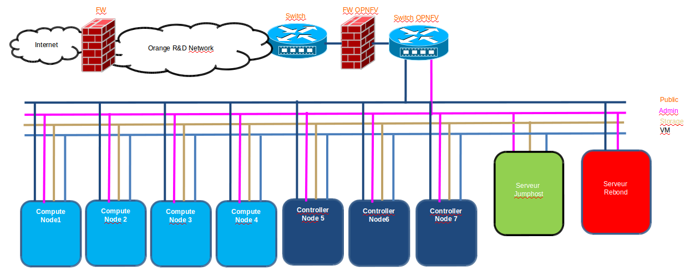

.. _pharos-orange-lannion-lab:

Orange OPNFV Testlab
==================================================

Overview
------------------

Orange Labs is hosting an OPNFV testlab at its Lannion facility. The testlab would host baremetal
servers for the use of OPNFV community as part of the OPNFV Pharos Project

The Orange Testlab consists of PODs
      * POD2 for Joid

POD2 consists of 8 servers
    * 1 Jump Server
    * 4 Servers for Control Nodes
    * 3 Servers for Compute Nodes

Hardware details
-----------------

All the servers within the two PODs reside within a two chassis and have the
following specifications:

POD2-Joid
^^^^^^^^^^^^

+---------+--------------------+-------+-----------------------------------+------------------------------------------+-----+-------+-------------------------------------------+-----+-------+
| Hostname|  Model             |Memory |Storage                            | Processor 1                              |Cores|Threads| Processor 2                               |Cores|Threads|
+---------+--------------------+-------+-----------------------------------+------------------------------------------+-----+-------+-------------------------------------------+-----+-------+
| Node1   |ProLiant DL380 Gen9 |128 GB |2xIntel SSD S3500 480GB+1 SAS 300GB|Intel(R) Xeon(R) CPU E5-2699 v3 @ 2.30GHz | 18  |  36   | Intel(R) Xeon(R) CPU E5-2699 v3 @ 2.30GHz |  18 |  36   |
+---------+--------------------+-------+-----------------------------------+------------------------------------------+-----+-------+-------------------------------------------+-----+-------+
| Node2   |ProLiant DL380 Gen9 |128 GB |2xIntel SSD S3500 480GB+  SAS 300GB|Intel(R) Xeon(R) CPU E5-2699 v3 @ 2.30GHz | 18  |  36   | Intel(R) Xeon(R) CPU E5-2699 v3 @ 2.30GHz |  18 |  36   |
+---------+--------------------+-------+-----------------------------------+------------------------------------------+-----+-------+-------------------------------------------+-----+-------+
| Node3   |ProLiant DL380 Gen9 |128 GB |2xIntel SSD S3500 480GB+1 SAS 300GB|Intel(R) Xeon(R) CPU E5-2699 v3 @ 2.30GHz | 18  |  36   | Intel(R) Xeon(R) CPU E5-2699 v3 @ 2.30GHz |  18 |  36   |
+---------+--------------------+-------+-----------------------------------+------------------------------------------+-----+-------+-------------------------------------------+-----+-------+
| Node4   |ProLiant DL380 Gen9 |128 GB |2xIntel SSD S3500 480GB+1 SAS 300GB|Intel(R) Xeon(R) CPU E5-2609 v3 @ 1.90GHz |  6  |   6   | Intel(R) Xeon(R) CPU E5-2609 v3 @ 1.90GHz |  6  |  6    |
+---------+--------------------+-------+-----------------------------------+------------------------------------------+-----+-------+-------------------------------------------+-----+-------+
| Node5   |ProLiant DL360 Gen9 |32 GB  |2xSAS 300GB                        |Intel(R) Xeon(R) CPU E5-2683 v3 @ 2.00GHz | 14  |  28   |                  N/A                      |     |       |
+---------+--------------------+-------+-----------------------------------+------------------------------------------+-----+-------+-------------------------------------------+-----+-------+
| Node6   |ProLiant DL360 Gen9 |32 GB  |2xSAS 300GB                        |Intel(R) Xeon(R) CPU E5-2683 v3 @ 2.00GHz | 14  |  28   |                  N/A                      |     |       |
+---------+--------------------+-------+-----------------------------------+------------------------------------------+-----+-------+-------------------------------------------+-----+-------+
| Node7   |ProLiant DL360 Gen9 |32 GB  |2xSAS 300GB                        |Intel(R) Xeon(R) CPU E5-2683 v3 @ 2.00GHz | 14  |  28   |                  N/A                      |     |       |
+---------+--------------------+-------+-----------------------------------+------------------------------------------+-----+-------+-------------------------------------------+-----+-------+

Software
---------

The Jump servers in the Testlab are pre-provisioned with the following softwares:

 * Joid-Jump Server:

 1. OS: Ubuntu 14.04

Networks
----------

POD2-Joid
^^^^^^^^^^^^

+--------------+--------------------------------------+-------+-------------------+-----+--------+
| Hostname     |  NIC Model                           | Ports | MAC               | BW  | Roles  |
+--------------+--------------------------------------+-------+-------------------+-----+--------+
| Node1        |  1, Broadcom NetXtreme BCM5719       | eth0  | 38:63:bb:3f:bc:c8 | 10G |  Admin |
+--------------+--------------------------------------+-------+-------------------+-----+--------+
|              |                                      | eth1  | 38:63:bb:3f:bc:c9 | 10G |  Public|
+--------------+--------------------------------------+-------+-------------------+-----+--------+
|              |  2, Broadcom NetXtreme BCM5719       | eth2  | 38:63:bb:3f:bc:ca | 10G |  N/A   |
+--------------+--------------------------------------+-------+-------------------+-----+--------+
|              |                                      | eth3  | 38:63:bb:3f:bc:cb | 10G |  N/A   |
+--------------+--------------------------------------+-------+-------------------+-----+--------+
|              |  3,  Intel X540-AT2  DPDK            | eth4  | a0:36:9f:4e:88:5c | 10G | Storage|
+--------------+--------------------------------------+-------+-------------------+-----+--------+
|              |                                      | eth5  | a0:36:9f:4e:88:5e | 10G |  VM    |
+--------------+--------------------------------------+-------+-------------------+-----+--------+
| Node2        |  1, Broadcom NetXtreme BCM5719       | eth0  | 38:63:bb:44:34:84 | 10G |  Admin |
+--------------+--------------------------------------+-------+-------------------+-----+--------+
|              |                                      | eth1  | 38:63:bb:44:34:85 | 10G |  Public|
+--------------+--------------------------------------+-------+-------------------+-----+--------+
|              |  2, Broadcom NetXtreme BCM5719       | eth2  | 38:63:bb:44:34:86 | 10G |  N/A   |
+--------------+--------------------------------------+-------+-------------------+-----+--------+
|              |                                      | eth3  | 38:63:bb:44:34:87 | 10G |  N/A   |
+--------------+--------------------------------------+-------+-------------------+-----+--------+
|              |  3,  Intel X540-AT2     DPDK         | eth4  | a0:36:9f:4e:8b:0c | 10G | Storage|
+--------------+--------------------------------------+-------+-------------------+-----+--------+
|              |                                      | eth5  | a0:36:9f:4e:8b:0e | 10G |  VM    |
+--------------+--------------------------------------+-------+-------------------+-----+--------+
| Node3        |  1, Broadcom NetXtreme BCM5719       | eth0  | 38:63:bb:3f:1d:8c | 10G |  Admin |
+--------------+--------------------------------------+-------+-------------------+-----+--------+
|              |                                      | eth1  | 38:63:bb:3f:1d:8d | 10G |  Public|
+--------------+--------------------------------------+-------+-------------------+-----+--------+
|              |  1, Broadcom NetXtreme BCM5719       | eth2  | 38:63:bb:3f:1d:8e | 10G |  N/A   |
+--------------+--------------------------------------+-------+-------------------+-----+--------+
|              |                                      | eth3  | 38:63:bb:3f:1d:8f | 10G |  N/A   |
+--------------+--------------------------------------+-------+-------------------+-----+--------+
|              |  3,  Intel X540-AT2     DPDK         | eth4  | a0:36:9f:4e:88:38 | 10G | Storage|
+--------------+--------------------------------------+-------+-------------------+-----+--------+
|              |                                      | eth5  | a0:36:9f:4e:88:3a | 10G |  VM    |
+--------------+--------------------------------------+-------+-------------------+-----+--------+
| Node4        |  1, Broadcom NetXtreme BCM5719       | eth0  | 38:63:bb:3f:2d:a8 | 10G |  Admin |
+--------------+--------------------------------------+-------+-------------------+-----+--------+
|              |                                      | eth1  | 38:63:bb:3f:2d:a9 | 10G |  Public|
+--------------+--------------------------------------+-------+-------------------+-----+--------+
|              |  1, Broadcom NetXtreme BCM5719       | eth2  | 38:63:bb:3f:2d:aa | 10G |  N/A   |
+--------------+--------------------------------------+-------+-------------------+-----+--------+
|              |                                      | eth3  | 38:63:bb:3f:2d:ab | 10G |  N/A   |
+--------------+--------------------------------------+-------+-------------------+-----+--------+
|              |  3,  Intel X540-AT2     DPDK         | eth4  | a0:36:9f:4e:8b:18 | 10G | Storage|
+--------------+--------------------------------------+-------+-------------------+-----+--------+
|              |                                      | eth5  | a0:36:9f:4e:8b:1a | 10G |  VM    |
+--------------+--------------------------------------+-------+-------------------+-----+--------+
| Node5        |  1, Broadcom NetXtreme BCM5719       | eth0  | 94:57:a5:52:c9:48 | 10G |  Admin |
+--------------+--------------------------------------+-------+-------------------+-----+--------+
|              |                                      | eth1  | 94:57:a5:52:c9:49 | 10G |  Public|
+--------------+--------------------------------------+-------+-------------------+-----+--------+
|              |  1, Broadcom NetXtreme BCM5719       | eth2  | 94:57:a5:52:c9:4a | 10G | Storage|
+--------------+--------------------------------------+-------+-------------------+-----+--------+
|              |                                      | eth3  | 94:57:a5:52:c9:4b | 10G |  VM    |
+--------------+--------------------------------------+-------+-------------------+-----+--------+
| Node6        |  1, Broadcom NetXtreme BCM5719       | eth0  | 94:57:a5:52:63:b0 | 10G |  Admin |
+--------------+--------------------------------------+-------+-------------------+-----+--------+
|              |                                      | eth1  | 94:57:a5:52:63:b1 | 10G |  Public|
+--------------+--------------------------------------+-------+-------------------+-----+--------+
|              |  1, Broadcom NetXtreme BCM5719       | eth2  | 94:57:a5:52:63:b2 | 10G | Storage|
+--------------+--------------------------------------+-------+-------------------+-----+--------+
|              |                                      | eth3  | 94:57:a5:52:63:b3 | 10G |  VM    |
+--------------+--------------------------------------+-------+-------------------+-----+--------+
| Node7        |  1, Broadcom NetXtreme BCM5719       | eth0  | 94:57:a5:52:f1:80 | 10G |  Admin |
+--------------+--------------------------------------+-------+-------------------+-----+--------+
|              |                                      | eth1  | 94:57:a5:52:f1:81 | 10G |  Public|
+--------------+--------------------------------------+-------+-------------------+-----+--------+
|              |  1, Broadcom NetXtreme BCM5719       | eth2  | 94:57:a5:52:f1:82 | 10G | Storage|
+--------------+--------------------------------------+-------+-------------------+-----+--------+
|              |                                      | eth3  | 94:57:a5:52:f1:83 | 10G |  VM    |
+--------------+--------------------------------------+-------+-------------------+-----+--------+

Subnet allocations Pod2
^^^^^^^^^^^^^^^^^^^^^^^^

+-----------+--------------+------------------+--------------+----------+
| Network   | Address      | Mask             | Gateway      | VLAN id  |
+-----------+--------------+------------------+--------------+----------+
|Admin      | 192.168.2.0  |  255.255.255.0   | 192.168.2.1  | 200      |
+-----------+--------------+------------------+--------------+----------+
|Public     | 161.105.231.0|  255.255.255.192 | 161.105.231.1| 135      |
+-----------+--------------+------------------+--------------+----------+
|Storage    | 192.168.12.0 |  255.255.255.0   | 192.168.2.1  | 210      |
+-----------+--------------+------------------+--------------+----------+
|VM         | 192.168.22.0 |  255.255.255.0   | 192.168.22.1 | 230      |
+-----------+--------------+------------------+--------------+----------+

ILO Pod2
^^^^^^^^

**POD2**

+-----------+--------------------+-------------------+-------------+-------------+
| Hostname  | Lights-out address | MAC               |    Username | Password    |
+-----------+--------------------+-------------------+-------------+-------------+
| Node1     | 192.168.2.11       | 38:63:bb:39:b2:2e |Administrator| pod2Admin   |
+-----------+--------------------+-------------------+-------------+-------------+
| Node2     | 192.168.2.12       | 14:58:d0:48:7b:7a |Administrator| pod2Admin   |
+-----------+--------------------+-------------------+-------------+-------------+
| Node3     | 192.168.2.13       | 38:63:bb:39:b2:86 |Administrator| pod2Admin   |
+-----------+--------------------+-------------------+-------------+-------------+
| Node4     | 192.168.2.14       | 38:63:bb:39:b2:40 |Administrator| pod2Admin   |
+-----------+--------------------+-------------------+-------------+-------------+
| Node5     | 192.168.2.15       | 94:57:a5:62:73:c2 |Administrator| pod2Admin   |
+-----------+--------------------+-------------------+-------------+-------------+
| Node6     | 192.168.2.16       | 94:57:a5:62:72:90 |Administrator| pod2Admin   |
+-----------+--------------------+-------------------+-------------+-------------+
| Node7     | 192.168.2.17       | 94:57:a5:62:f4:c6 |Administrator| pod2Admin   |
+-----------+--------------------+-------------------+-------------+-------------+

Remote access infrastructure
-----------------------------

The Orange OPNFV testlab is free to use for the OPNFV community.

To access the Testlab, please contact bertrand.lelamer AT orange.com with
the following details:
* Name
* Email
* Designation
* Organization
* Purpose of using the lab
* SSH public key

*Accessing the Orange Lannion Testlab*
--------------------------------------

POD2 JumpServer
^^^^^^^^^^^^^^^

