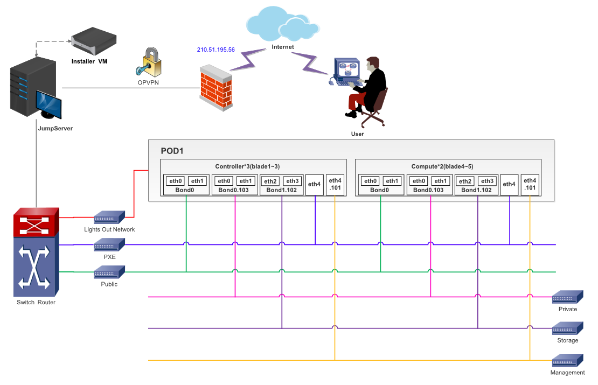

.. This work is licensed under a Creative Commons Attribution 4.0 International License.
.. http://creativecommons.org/licenses/by/4.0
.. (c) 2016 OPNFV.

.. _pharos_lab:

************************
ZTE NJ Lab Specification
************************

Introduction
------------

ZTE NJ Pharos lab currently has two PODs available in Nanjing. Each POD has 5 servers, 3 controller
nodes and 2 computer nodes. They are dedicatedly used for CI. These PODs focus scenarios related
with **test** projects and **installer** projects.

There are also several other developing PODs, which are not listed here.

Lab Resources
-------------

+----------+------------+-----------+-------------------------+------------+--------+-----------+
| POD Name | Project(s) | PTL(s)    | Email(s)                | POD Role   | Status | Notes     |
+----------+------------+-----------+-------------------------+------------+--------+-----------+
| POD1     | FUEL       | Gregory   | gelkinbard@mirantis.com | CI: latest | Active | Yardstick |
|          |            | Elkinbard |                         |            |        | Funtest   |
|          |            |           |                         |            |        | Doctor    |
|          |            |           |                         |            |        | Parser    |
+----------+------------+-----------+-------------------------+------------+--------+-----------+
| POD2     | FUEL       | Gregory   | gelkinbard@mirantis.com | CI: latest | Active | Qtip      |
|          |            | Elkinbard |                         |            |        |           |
+----------+------------+-----------+-------------------------+------------+--------+-----------+

* `POD1/POD2 wiki <https://wiki.opnfv.org/display/pharos/ZTE+NJ+Testlab>`_
* `POD1 jenkins slave <https://build.opnfv.org/ci/computer/zte-pod1/>`_
* `POD2 jenkins slave <https://build.opnfv.org/ci/computer/zte-pod2/>`_

Acceptable Usage Policy
-----------------------

Resources located in OPNFV ZTE NJ Lab shall only be used for CI, infra setup/configuration and
troubleshooting purposes. No development work is allowed in these PODs.

Remote Access Infrastructure
----------------------------

ZTE lab provide the OpenVPN access for you.

Remote Access Procedure
-----------------------

Access to this environment can be granted by sending an e-mail to:"wu.zhihui1@zte.com.cn"

Subject: opnfv zte-pod[1-2] access.

The following information should be provided in the request:

::

    Full name:
    E-mail:
    Organization:
    Why is access needed:
    How long is access needed:
    What sepcific Host will be accessed:
    What support is needed from zte admin:

Once access requirment is approved, the instructions for setting up VPN access will be send to you
by mail.

Lab Documentation
-----------------

Lab Topology
------------

