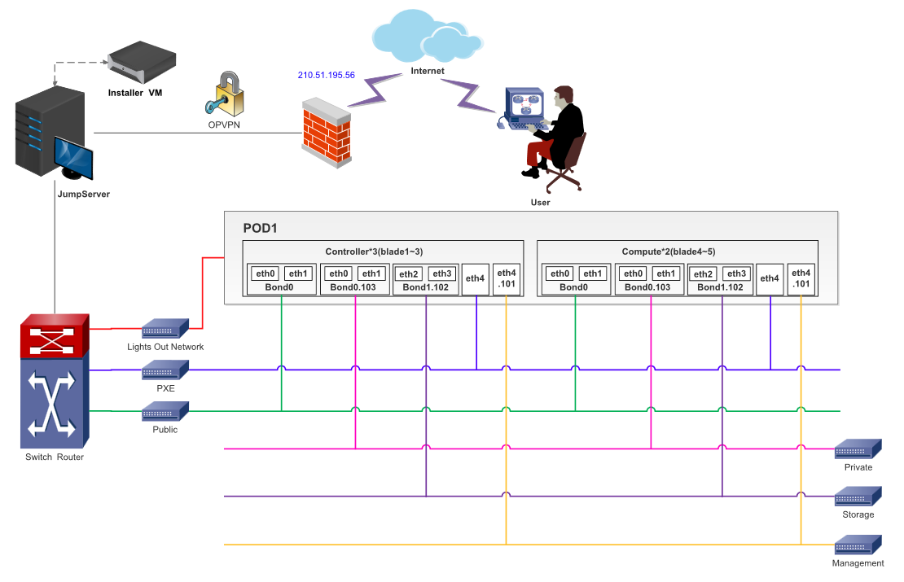

.. This work is licensed under a Creative Commons Attribution 4.0 International License.
.. http://creativecommons.org/licenses/by/4.0
.. (c) 2016 OPNFV.

.. _pharos_pod:

**************************
POD Specification Template
**************************

Introduction
------------

ZTE is hosting an OPNFV testlab at Nanjing facility. The testlab would host baremetal servers for the use of OPNFV community as part of the OPNFV Pharos Project.
There is one pod used for CI latest and benchmark tests(Yardstick, Functest) based on Fuel.

Additional Requirements
-----------------------

Server Specifications
---------------------

**Jump Host**

+--------------+--------------+--------------+--------------+--------------+--------------+--------------+------------------------+------------------------+------------------------+--------------+
|              |              |              |              |              |              | Local        | Lights-out network     | 1GbE: NIC#/IP          | 10GbE: NIC#/IP         |              |
|  Hostname    |  Vendor      | Model        | Serial Number|  CPUs        | Memory       | storage      | (IPMI): IP/MAC, U/P    | MAC/VLAN/Network       | MAC/VLAN/Network       | Notes        |
+--------------+--------------+--------------+--------------+--------------+--------------+--------------+------------------------+------------------------+------------------------+--------------+
| Jumpserver   |  ZTE         | ZTE R4300    | 277662500093 |  2 x E5-2620 |  32 GB       | 600GB HDD    | 10.47.205.3            | IF0: 10.20.0.1         |                        |              |
|              |              |              |              |              |              |              | 98:F5:37:E1:B4:18      | 98:F5:37:E1:B4:1C      |                        |              |
|              |              |              |              |              |              |              | zteroot/superuser      | VLAN 1                 |                        |              |
|              |              |              |              |              |              |              |                        | PXE                    |                        |              |
|              |              |              |              |              |              |              |                        |                        |                        |              |
|              |              |              |              |              |              |              |                        |                        |                        |              |
|              |              |              |              |              |              |              |                        |                        |                        |              |
|              |              |              |              |              |              |              |                        |                        |                        |              |
+--------------+--------------+--------------+--------------+--------------+--------------+--------------+------------------------+------------------------+------------------------+--------------+

**Compute Nodes**

+--------------+--------------+--------------+--------------+--------------+--------------+--------------+------------------------+------------------------+------------------------+--------------+
|              |              |              |              |              |              | Local        | Lights-out network     | 1GbE: NIC#/IP          | 10GbE: NIC#/IP         |              |
|  Hostname    |  Vendor      | Model        | Serial Number|  CPUs        | Memory       | storage      | (IPMI): IP/MAC, U/P    | MAC/VLAN/Network       | MAC/VLAN/Network       | Notes        |
+--------------+--------------+--------------+--------------+--------------+--------------+--------------+------------------------+------------------------+------------------------+--------------+
| pod1-jp-node1|  ZTE	        |  ZTE E9000   | 281498500141 |  E5-2680 * 2 |  128GB       |  600GB HDD   |  129.5.1.101           |  enp129s0f0:           |  enp2s0f0:             |              |
|              |              |              |              |              |              |              |  4c:09:b4:b2:59:87     |  4c:09:b4:b2:59:87     |  4c:09:b4:b1:de:38     |              |
|              |              |              |              |              |              |              |  zteroot/superuser     |  vlan 1/PXE            |  vlan 1/ public        |              |
|              |              |              |              |              |              |              |                        |  vlan 101/admin        |  vlan 103/ private     |              |
|              |              |              |              |              |              |              |                        |                        |  enp2s0f1:             |              |
|              |              |              |              |              |              |              |                        |                        |  4c:09:b4:b1:de:39     |              |
|              |              |              |              |              |              |              |                        |                        |  vlan 1/ public        |              |
|              |              |              |              |              |              |              |                        |                        |  vlan 103/ private     |              |
|              |              |              |              |              |              |              |                        |                        |  enp132s0f0:           |              |
|              |              |              |              |              |              |              |                        |                        |  4c:09:b4:b1:de:3a     |              |
|              |              |              |              |              |              |              |                        |                        |  vlan 102/ storage     |              |
|              |              |              |              |              |              |              |                        |                        |  enp132s0f1:           |              |
|              |              |              |              |              |              |              |                        |                        |  4c:09:b4:b1:de:3b     |              |
|              |              |              |              |              |              |              |                        |                        |  vlan 102/ storage     |              |
+--------------+--------------+--------------+--------------+--------------+--------------+--------------+------------------------+------------------------+------------------------+--------------+
| pod1-jp-node2|  ZTE	        |  ZTE E9000   | 281498500179 |  E5-2680 * 2 |  128GB       |  600GB HDD   |  129.5.1.22            |  enp129s0f0:           |  enp2s0f0:             |              |
|              |              |              |              |              |              |              |  4c:09:b4:b2:59:fc     |  4c:09:b4:b2:59:fc     |  4c:09:b4:b1:de:40     |              |
|              |              |              |              |              |              |              |  zteroot/superuser     |  vlan 1/PXE            |  vlan 1/ public        |              |
|              |              |              |              |              |              |              |                        |  vlan 101/admin        |  vlan 103/ private     |              |
|              |              |              |              |              |              |              |                        |                        |  enp2s0f1:             |              |
|              |              |              |              |              |              |              |                        |                        |  4c:09:b4:b1:de:41     |              |
|              |              |              |              |              |              |              |                        |                        |  vlan 1/ public        |              |
|              |              |              |              |              |              |              |                        |                        |  vlan 103/ private     |              |
|              |              |              |              |              |              |              |                        |                        |  enp132s0f0:           |              |
|              |              |              |              |              |              |              |                        |                        |  4c:09:b4:b1:de:42     |              |
|              |              |              |              |              |              |              |                        |                        |  vlan 102/ storage     |              |
|              |              |              |              |              |              |              |                        |                        |  enp132s0f1:           |              |
|              |              |              |              |              |              |              |                        |                        |  4c:09:b4:b1:de:43     |              |
|              |              |              |              |              |              |              |                        |                        |  vlan 102/ storage     |              |
+--------------+--------------+--------------+--------------+--------------+--------------+--------------+------------------------+------------------------+------------------------+--------------+
| pod1-jp-node3|  ZTE	        |  ZTE E9000   | 281498500008 |  E5-2680 * 2 |  128GB       |  600GB HDD   |  129.5.1.3             |  enp129s0f0:           |  enp2s0f0:             |              |
|              |              |              |              |              |              |              |  4c:09:b4:b2:59:a2     |  4c:09:b4:b2:59:a2     |  4c:09:b4:b1:de:1c     |              |
|              |              |              |              |              |              |              |  zteroot/superuser     |  vlan 1/PXE            |  vlan 1/ public        |              |
|              |              |              |              |              |              |              |                        |  vlan 101/admin        |  vlan 103/ private     |              |
|              |              |              |              |              |              |              |                        |                        |  enp2s0f1:             |              |
|              |              |              |              |              |              |              |                        |                        |  4c:09:b4:b1:de:1d     |              |
|              |              |              |              |              |              |              |                        |                        |  vlan 1/ public        |              |
|              |              |              |              |              |              |              |                        |                        |  vlan 103/ private     |              |
|              |              |              |              |              |              |              |                        |                        |  enp132s0f0:           |              |
|              |              |              |              |              |              |              |                        |                        |  4c:09:b4:b1:de:1e     |              |
|              |              |              |              |              |              |              |                        |                        |  vlan 102/ storage     |              |
|              |              |              |              |              |              |              |                        |                        |  enp132s0f1:           |              |
|              |              |              |              |              |              |              |                        |                        |  4c:09:b4:b1:de:1f     |              |
|              |              |              |              |              |              |              |                        |                        |  vlan 102/ storage     |              |
+--------------+--------------+--------------+--------------+--------------+--------------+--------------+------------------------+------------------------+------------------------+--------------+
| pod1-jp-node4|  ZTE	        |  ZTE E9000   | 281498500157 |  E5-2680 * 2 |  128GB       |  600GB HDD   |  129.5.1.4             |  enp129s0f0:           |  enp2s0f0:             |              |
|              |              |              |              |              |              |              |  4c:09:b4:b2:59:d8     |  4c:09:b4:b2:59:d8     |  4c:09:b4:b1:de:18     |              |
|              |              |              |              |              |              |              |  zteroot/superuser     |  vlan 1/PXE            |  vlan 1/ public        |              |
|              |              |              |              |              |              |              |                        |  vlan 101/admin        |  vlan 103/ private     |              |
|              |              |              |              |              |              |              |                        |                        |  enp2s0f1:             |              |
|              |              |              |              |              |              |              |                        |                        |  4c:09:b4:b1:de:19     |              |
|              |              |              |              |              |              |              |                        |                        |  vlan 1/ public        |              |
|              |              |              |              |              |              |              |                        |                        |  vlan 103/ private     |              |
|              |              |              |              |              |              |              |                        |                        |  enp132s0f0:           |              |
|              |              |              |              |              |              |              |                        |                        |  4c:09:b4:b1:de:1a     |              |
|              |              |              |              |              |              |              |                        |                        |  vlan 102/ storage     |              |
|              |              |              |              |              |              |              |                        |                        |  enp132s0f1:           |              |
|              |              |              |              |              |              |              |                        |                        |  4c:09:b4:b1:de:1b     |              |
|              |              |              |              |              |              |              |                        |                        |  vlan 102/ storage     |              |
+--------------+--------------+--------------+--------------+--------------+--------------+--------------+------------------------+------------------------+------------------------+--------------+
| pod1-jp-node5|  ZTE	        |  ZTE E9000   | 281498500119 |  E5-2680 * 2 |  128GB       |  600GB HDD   |  129.5.1.5             |  enp129s0f0:           |  enp2s0f0:             |              |
|              |              |              |              |              |              |              |  4c:09:b4:b2:59:75     |  4c:09:b4:b2:59:75     |  4c:09:b4:b1:de:48     |              |
|              |              |              |              |              |              |              |  zteroot/superuser     |  vlan 1/PXE            |  vlan 1/ public        |              |
|              |              |              |              |              |              |              |                        |  vlan 101/admin        |  vlan 103/ private     |              |
|              |              |              |              |              |              |              |                        |                        |  enp2s0f1:             |              |
|              |              |              |              |              |              |              |                        |                        |  4c:09:b4:b1:de:49     |              |
|              |              |              |              |              |              |              |                        |                        |  vlan 1/ public        |              |
|              |              |              |              |              |              |              |                        |                        |  vlan 103/ private     |              |
|              |              |              |              |              |              |              |                        |                        |  enp132s0f0:           |              |
|              |              |              |              |              |              |              |                        |                        |  4c:09:b4:b1:de:4a     |              |
|              |              |              |              |              |              |              |                        |                        |  vlan 102/ storage     |              |
|              |              |              |              |              |              |              |                        |                        |  enp132s0f1:           |              |
|              |              |              |              |              |              |              |                        |                        |  4c:09:b4:b1:de:4b     |              |
|              |              |              |              |              |              |              |                        |                        |  vlan 102/ storage     |              |
+--------------+--------------+--------------+--------------+--------------+--------------+--------------+------------------------+------------------------+------------------------+--------------+

VPN Users
---------

+--------------+--------------+--------------+--------------+--------------+
| Name         | Email        | Project      | Role         | Notes        |
+--------------+--------------+--------------+--------------+--------------+
|              |              |              |              |              |
+--------------+--------------+--------------+--------------+--------------+

Firewall Rules
--------------

+--------------+--------------+--------------+
| Port(s)      | Service      | Note         |
+--------------+--------------+--------------+
| 1194         | OPVPN        |              |
+--------------+--------------+--------------+

POD Topology
------------

