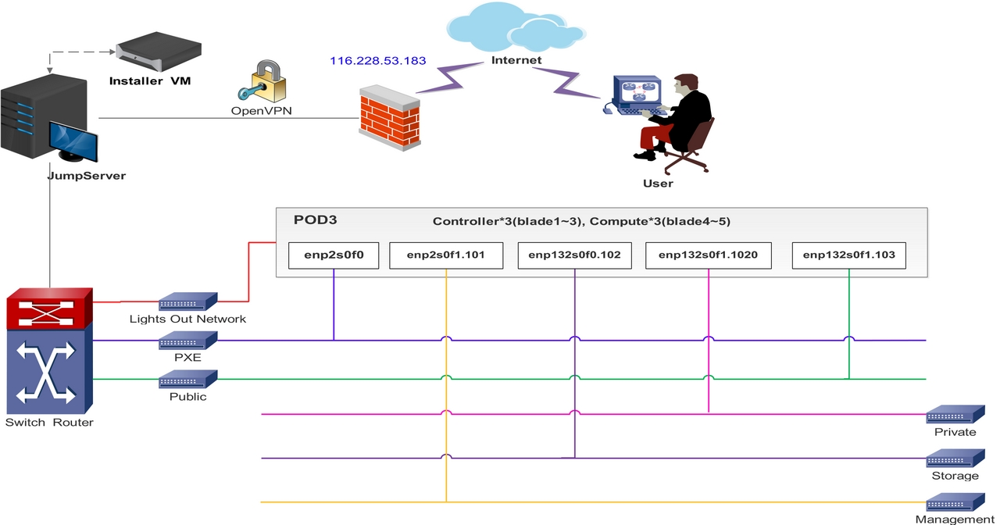

.. This work is licensed under a Creative Commons Attribution 4.0 International License.
.. http://creativecommons.org/licenses/by/4.0
.. (c) 2016 OPNFV.

.. _pharos_lab:

************************
ZTE SH Lab Specification
************************

Introduction
------------

ZTE SH Pharos lab currently has one POD available in Shanghai. The POD has 5 servers, 3 controller
nodes and 2 computer nodes. It is dedicatedly used for baremetal CI. The POD is supposed to support
scenarios related with performance enhancement projects, such as KVM, OVS, FDS, etc. 

Scenarios planned are list here:

- os-nosdn-kvm-ha
- os-nosdn-kvm_ovs-ha

Scenarios are defined in
`Colorado Scenario Status <https://wiki.opnfv.org/display/SWREL/Colorado+Scenario+Status>`_

Lab Resources
-------------

+----------+------------+-----------+-------------------------+------------+--------+---------+
| POD Name | Project(s) | PTL(s)    | Email(s)                | POD Role   | Status | Notes   |
+----------+------------+-----------+-------------------------+------------+--------+---------+
| POD3     | FUEL       | Gregory   | gelkinbard@mirantis.com | CI: latest | Active | NFV-KVM |
|          |            | Elkinbard |                         |            |        | OVSNFV  |
+----------+------------+-----------+-------------------------+------------+--------+---------+

- `POD3 wiki page <https://wiki.opnfv.org/display/pharos/ZTE+SH+Testlab>`_
- `POD3 jenkins slave <https://build.opnfv.org/ci/computer/zte-pod3/>`_

Acceptable Usage Policy
-----------------------

Resources located in OPNFV ZTE SH lab shall only be used for CI, infra setup/configuration and
troubleshooting purposes. No development work is allowed in this Lab.

Remote Access Infrastructure
----------------------------

ZTE SH lab provide the OpenVPN access for you.

Remote Access Procedure
-----------------------

Access to this environment can be granted by sending an e-mail to: **yangyang1@zte.com.cn**.

Subject: opnfv zte-pod3 access.

The following information should be provided in the request:

::

    Full name:
    E-mail:
    Organization:
    Why is access needed:
    How long is access needed:
    What sepcific Host will be accessed:
    What support is needed from zte admin:

Once access requirment is approved, the instructions for setting up VPN access will be send to you by mail.

Lab Documentation
-----------------

Lab Topology
------------

