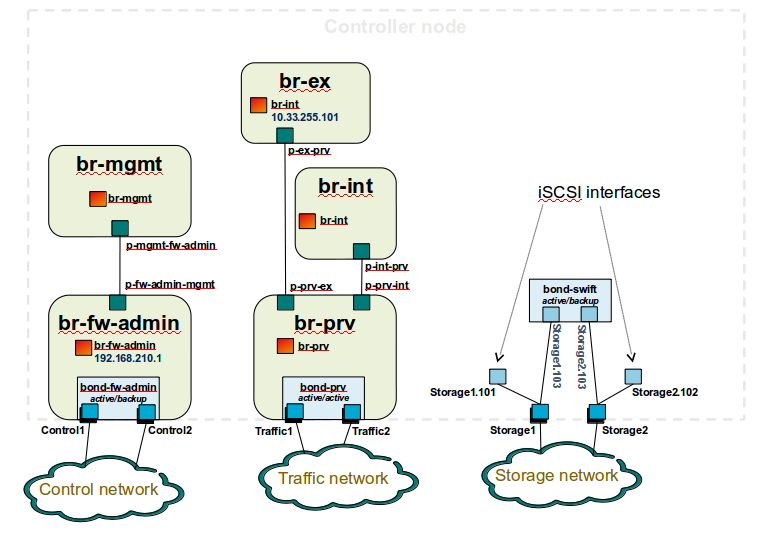
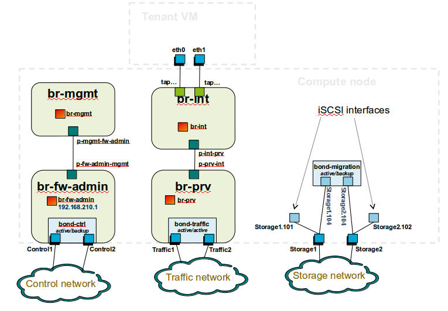
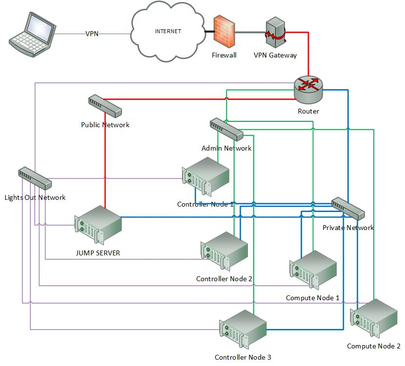
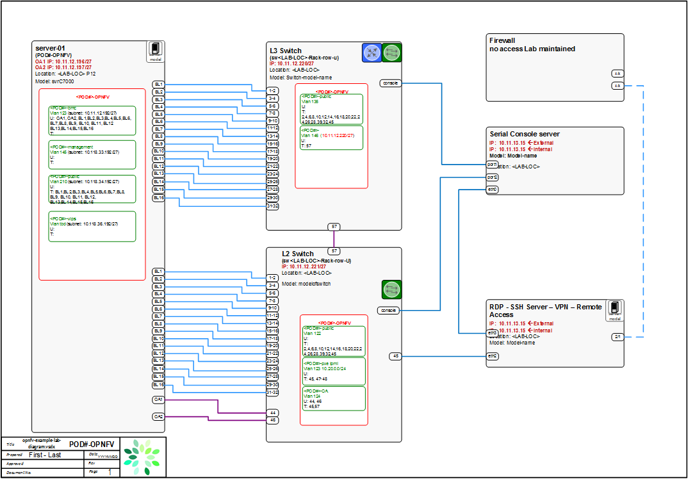

Pharos Specification
=====================

.. contents:: Table of Contents
   :backlinks: none

Objectives / Scope
-------------------

The Pharos specification defines the OPNFV hardware environment upon which the OPNFV 
Arno platform release can be deployed on and tested. This specification defines:

- A secure, scalable, standard and HA environment
- Supports the full Arno deployment lifecycle (this requires a bare metal environment)
- Supports functional and performance testing of the Arno release
- Provides mechanisms and procedures for secure remote access to the test environment

Deploying Arno in a Virtualized environment is possible and will be useful, however 
it does not provide a fully featured deployment and test environment for the Arno release of OPNFV.

The high level architecture is outlined in the following diagram:

.. image:: images/pharos-archi1.jpg

A Pharos compliant OPNFV test-bed environment provides
------------------------------------------------------

- One CentOS 7 jump server on which the virtualized Openstack/OPNFV installer runs
- In the Arno release you may select a deployment toolchain to deploy from the jump server 
from the Foreman and Fuel ISO images.
- 5 compute / controller nodes (`BGS <https://wiki.opnfv.org/get_started/get_started_work_environment>`_ requires 5 nodes)
- A configured network topology allowing for LOM, Admin, Public, Private, and Storage Networks
- Remote access as defined by the Jenkins slave configuration guide http://artifacts.opnfv.org/arno.2015.1.0/docs/opnfv-jenkins-slave-connection.arno.2015.1.0.pdf

Hardware requirements
---------------------

**Servers**

CPU:

* Intel Xeon E5-2600v2 Series (Ivy Bridge and newer, or similar)

Local Storage Configuration:

Below describes the minimum for the Pharos spec, which is designed to provide enough capacity for a reasonably 
functional environment. Additional and/or faster disks are nice to have and may produce a better result.

* Disks: 2 x 1TB + 1 x 100GB SSD
* The first 1TB HDD should be used for OS & additional software/tool installation
* The second 1TB HDD configured for CEPH object storage
* Finally, the 100GB SSD should be used as the CEPH journal
* Performance testing requires a mix of compute nodes that have CEPH(swift+Cinder) and without CEPH storage
* Virtual ISO boot capabilities or a separate PXE boot server (DHCP/tftp or Cobbler)

Memory:

* 32G RAM Minimum

Power Supply Single

* Single power supply acceptable (redundant power not required/nice to have)

Provisioning the jump server
----------------------------

1. Obtain CentOS 7 Minimal ISO and install

  ``wget http://mirrors.kernel.org/centos/7/isos/x86_64/CentOS-7-x86_64-Minimal-1503-01.iso``

2. Set parameters appropriate for your environment during installation

3. Disable NetworkManager

  ``systemctl disable NetworkManager``

4. Configure your /etc/sysconfig/network-scripts/ifcfg-* files for your network

5. Restart networking

  ``service network restart``

6. Edit /etc/resolv.conf and add a nameserver

  ``vi /etc/resolv.conf``

7. Install libvirt & kvm

  ``yum -y update``
  ``yum -y install kvm qemu-kvm libvirt``
  ``systemctl enable libvirtd``

8. Reboot:

  ``shutdown -r now``

9. If you wish to avoid annoying delay when use ssh to log in, disable DNS lookups:

  ``vi /etc/ssh/sshd_config``
  Uncomment "UseDNS yes", change 'yes' to 'no'.
  Save

10. Restart sshd

  ``systemctl restart sshd``

11. Install virt-install

  ``yum -y install virt-install``

12. Begin the installation of the Arno release

  Download your preferred ISO from the `OPNFV dowloads page <http://www.opnfv.org/software/download>`_ and follow the associated installation instructions.

Remote management
------------------

**Remote access**

- Remote access is required for …

  1. Developers to access deploy/test environments (credentials to be issued per POD / user)
  2. Connection of each environment to Jenkins master hosted by Linux Foundation for automated deployment and test

- OpenVPN is generally used for remote however community hosted labs may vary due to company security rules
- POD access rules / restrictions …

  - Refer to individual test-bed as each company may have different access rules and acceptable usage policies

- Basic requirement is for SSH sessions to be established (initially on jump server)
- Majority of packages installed on a system (tools or applications) will be pulled from an external repo so this scenario must be accomodated.

Firewall rules should include

- SSH sessions
- Jenkins sessions

Lights-out Management:

- Out-of-band management for power on/off/reset and bare-metal provisioning
- Access to server is through lights-out-management tool and/or a serial console
- Intel lights-out ⇒ RMM http://www.intel.com/content/www/us/en/server-management/intel-remote-management-module.html
- HP lights-out ⇒ ILO http://www8.hp.com/us/en/products/servers/ilo/index.html
- CISCO lights-out ⇒ UCS https://developer.cisco.com/site/ucs-dev-center/index.gsp
- Dell lights-out  ⇒ IDRAC  http://en.community.dell.com/techcenter/systems-management/w/wiki/3204.dell-remote-access-controller-drac-idrac

Linux Foundation - VPN service for accessing Lights-Out Management (LOM) infrastructure for the UCS-M hardware

- People with admin access to LF infrastructure:

1. amaged@cisco.com
2. cogibbs@cisco.com
3. daniel.smith@ericsson.com
4. dradez@redhat.com
5. fatih.degirmenci@ericsson.com
6. fbrockne@cisco.com
7. jonas.bjurel@ericsson.com
8. jose.lausuch@ericsson.com
9. joseph.gasparakis@intel.com
10. morgan.richomme@orange.com
11. pbandzi@cisco.com
12. phladky@cisco.com
13. stefan.k.berg@ericsson.com
14. szilard.cserey@ericsson.com
15. trozet@redhat.com

- The people who require VPN access must have a valid PGP key bearing a valid signature from one of these three people. When issuing OpenVPN credentials, LF will be sending TLS certificates and 2-factor authentication tokens, encrypted to each recipient's PGP key.

Networking
-----------

Test-bed network

* 24 or 48 Port TOR Switch
* NICS - 1GE, 10GE - per server can be on-board or PCI-e
* Connectivity for each data/control network is through a separate NIC. This simplifies Switch Management however requires more NICs on the server and also more switch ports
* Lights-out network can share with Admin/Management

Network Interfaces

* Option I: 4x1G Control, 2x40G Data, 48 Port Switch

  * 1 x 1G for ILMI (Lights out Management )
  * 1 x 1G for Admin/PXE boot
  * 1 x 1G for control Plane connectivity
  * 1 x 1G for storage
  * 2 x 40G (or 10G) for data network (redundancy, NIC bonding, High bandwidth testing)

* Option II: 1x1G Control, 2x 40G (or 10G) Data, 24 Port Switch

  * Connectivity to networks is through VLANs on the Control NIC. Data NIC used for VNF traffic and storage traffic segmented through VLANs

* Option III: 2x1G Control, 2x10G Data, 2x40G Storage, 24 Port Switch

  * Data NIC used for VNF traffic, storage NIC used for control plane and Storage segmented through VLANs (separate host traffic from VNF)
  * 1 x 1G for IPMI
  * 1 x 1G for Admin/PXE boot
  * 2 x 10G for control plane connectivity/Storage
  * 2 x 40G (or 10G) for data network

Documented configuration to include:
- Subnet, VLANs (may be constrained by existing lab setups or rules)
- IPs
- Types of NW - lights-out, public, private, admin, storage
- May be special NW requirements for performance related projects
- Default gateways

Controller node bridge topology overview

compute node bridge topology overview

Architecture
-------------

** Network Diagram **

The Pharos architecture may be described as follow: Figure 1: Standard Deployment Environment

Figure 1: Standard Deployment Environment

Sample Network Drawings
-----------------------

Files for documenting lab network layout. These were contributed as Visio VSDX format compressed as a ZIP file. Here is a sample of what the visio looks like.

Download the visio zip file here: `opnfv-example-lab-diagram.vsdx.zip <https://wiki.opnfv.org/_media/opnfv-example-lab-diagram.vsdx.zip>`_

:Authors: Trevor Cooper (Intel)
:Version: 1.0

**Documentation tracking**

Revision: _sha1_

Build date:  _date_

