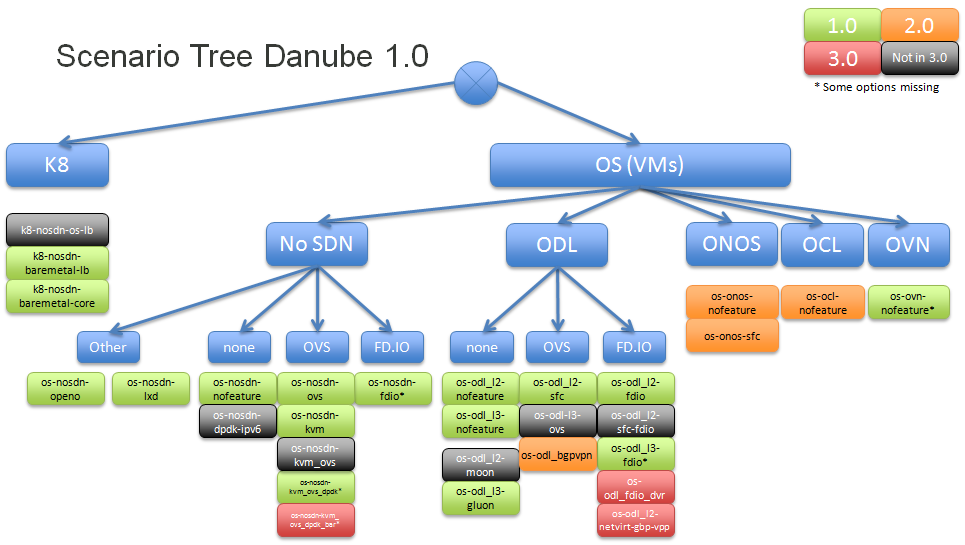

.. This work is licensed under a Creative Commons Attribution 4.0 International License.
.. http://creativecommons.org/licenses/by/4.0
.. (c) 2017 OPNFV Ulrich Kleber (Huawei)

Current Status
---------------

This chapter summarizes the scenario analysis to provide some background.
It also defines the way to introduce the scenario processes.

Arno
^^^^^^^^

In Arno release, the scenario concept was not created yet.
Looking back, we can say we had one scenario with OpenStack, ODL and KVM,
that could be deployed in two ways, by the two installers available in Arno.

Brahmaputra
^^^^^^^^^^^^^^^^

In Brahmaputra, we added options for SDN (ONOS, OCL) and some optional
features (sfc, sdnvpn, kvm, l3 enabled ODL).
Thus we had 9 scenarios, some of them to be deployed with 2 installers,
that planned to participate in the release. Not all of them succeeded.

Colorado
^^^^^^^^^^^^

In Colorado more components and features were added to a total of 17
combinations of components and features. Some were supported by one
of the four installers, others by multiple installers. In addition HA
and NOHA options were defined.
This lead to 28 combinations that planned to participate.

Danube
^^^^^^^^^^

In Danube the number of combinations of components and features increased
to 24, but since installer support increased and more scenarios planned
to provide HA and NOHA options, the number of combinations was 54.

In addition to that some scenarios were defined later in during development
and some scenarios worked on ARM support.

This created the need to better understand relationships and
incompatibilities of the scenarios to drive for a manageable process
for scenarios.

As a result the relationship between the scenarios can be
visualized by a scenario tree.

The process for generic and specific scenarios is not in place for the
Danube release yet. But the different branches of the scenario tree
provide the candidates to define generic scenario during the timeframe
of the next release.

Euphrates
^^^^^^^^^^

tbd: statistics on Euphrates Scenarios

During Euphrates timeframe, dynamic POD allocation is introduced in CI.
This is a prerequisite to make use of the SDF in the CI pipeline.
Therefore in this timeframe, scenario processes are introduced only in
a documentation way and as support for release management.

Also the definition of generic scenarios can be done.

