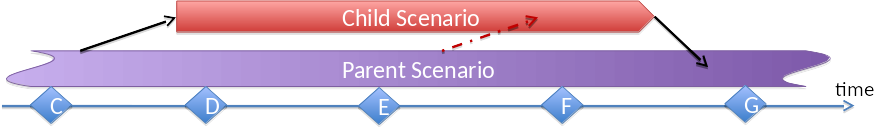

.. This work is licensed under a Creative Commons Attribution 4.0 International License.
.. http://creativecommons.org/licenses/by/4.0
.. (c) 2017 OPNFV Ulrich Kleber (Huawei)

Parent - Child Relations
-------------------------

In many cases, development adds a feature to an existing scenario by adding additional
components. This is called creating a child scenario from a parent.

* Parent scenarios typically are more stable than children.
* Children should plan to merge their feature back to the parent.
* Merge back will often add components to the parent.

* Child scenarios can be part of releases.
* Child scenarios should merge back to their parent after 2 releases.
* If a child scenario lives through several releases, it might be desirable
  to “rebase/cherrypick” a child scenario to follow changes in the parent scenario.
* Child scenarios typically support a smaller number of deployment options than
  their parent

Child scenarios are specific scenarios. Parent scenarios can be generic or specific
scenarios.

Child scenarios can be created any time. If they want to join a release, they have
to be created before MS0 of that release.

Siblings
^^^^^^^^^^^^^^^^^^^^^^^^^^^^^^^^^^^^^

In some cases it could make more sense to create a sibling rather than a child
(e.g. if expected that merging back to parent will be difficult).
In other words, the content of a child scenario will be incompatible with content
of the parent scenario.
In that case, the child scenario should rather become a new branch instead of
merging back to the parent.

.. figure:: sibling.png

Typically the sibling uses alternate components/solutions than the parent – in
long term it might evolve into a new generic scenario, that is a new branch
in the scenario tree.

Creation of the sibling shall not be gated. It should be covered in the scope of
an approved project, so there cannot be too big surprises.

But at a certain time the new scenario will want to change its status from a
specific scenario to a generic scenario. This move will need TSC approval.
For the application, the scenario owner shall demonstrate that the scenario
fulfills the requirements of a generic scenario (see later).

Examples: SDN controller options, Container technologies, data plane solutions,
MANO solutions.

Please note that from time to time, the TSC will need to review the
set of generic scenarios and "branches" in the scenario tree.

