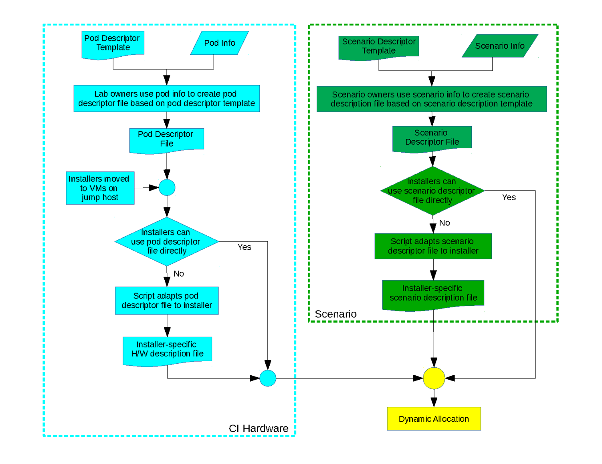
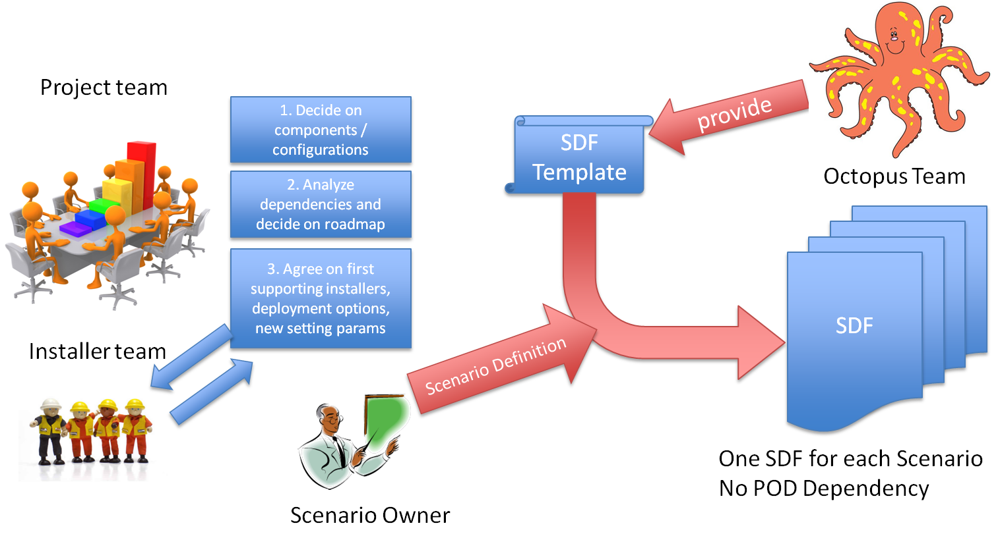

.. This work is licensed under a Creative Commons Attribution 4.0 International License.
.. http://creativecommons.org/licenses/by/4.0
.. (c) 2017 OPNFV Ulrich Kleber (Huawei)

Workflows
----------

Summary
^^^^^^^^

The general principle can be summarized by the following diagram:

Workflows for Scenario Owners
^^^^^^^^^^^^^^^^^^^^^^^^^^^^^^^^

The scenario owner creates the descriptor file based on the template.

Create new scenario from scratch
+++++++++++++++++++++++++++++++++++++++++++++++++

This workflow will be exceptional.
Most scenarios can easier start as children of an existing scenario;
thus the author (scenario owner) can derive the SDF from the parent.
But scenarios introducing new technologies affecting the whole architecture,
e.g.containers, or higher level scenarios (e.g.MANO and Multisite which
reference existing scenarios) can start without a parent.

The following steps need to be done:

  #. (Project team) Define set of components that need to be deployed
  #. (Project) Find installers that can deploy the components
  #. (Project&installer&CI) Agree on new keywords in SDF (e.g. component, feature name)
  #. (Project) Assign owner
  #. (Owner) Edit SDF, submit to octopus repo
  #. (Owner) register scenario to participate in release as appropriate
  #. (Owner&CI-team) Adapt jenkins triggers, so new scenario can be scheduled in valid installer/POD/Options combination(s).
  #. (Installer-team) test deployment of components
  #. (Project-team) Define test cases; register in test db

Create child scenario by adding feature to existing scenario
+++++++++++++++++++++++++++++++++++++++++++++++++++++++++++++

Add additional installer to a specific scenario
++++++++++++++++++++++++++++++++++++++++++++++++

Add additional hardware or availability option to a scenario
++++++++++++++++++++++++++++++++++++++++++++++++++++++++++++++

Merge child scenario back to parent
++++++++++++++++++++++++++++++++++++

Promote specific scenario to generic scenario
++++++++++++++++++++++++++++++++++++++++++++++

Introduce SDF for existing Danube/Euphrates scenarios
++++++++++++++++++++++++++++++++++++++++++++++++++++++

Workflows for Installers
^^^^^^^^^^^^^^^^^^^^^^^^^

Workflows for CI Tools
^^^^^^^^^^^^^^^^^^^^^^^^^^

