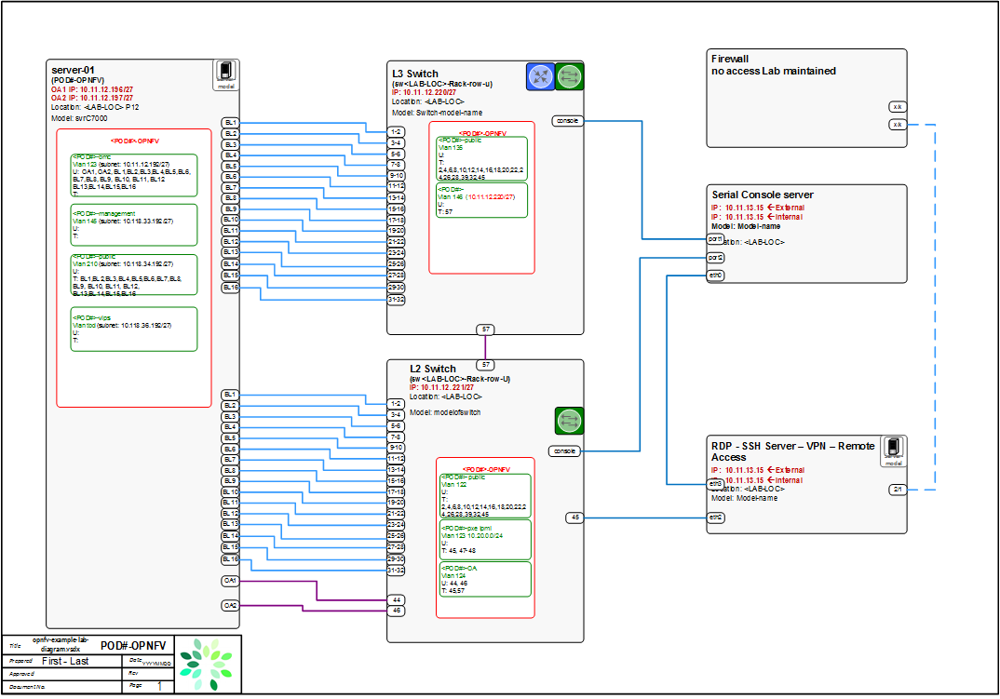

Pharos Specification
=====================

Objectives / Scope
-------------------

Pharos spec defines the OPNFV test environment (in which OPNFV platform can be deployed and tested …

- Provides a secure, scalable, standard and HA environment
- Supports full deployment lifecycle (this requires a bare metal environment)
- Supports functional and performance testing
- Provides common tooling and test scenarios (including test cases and workloads) available to the community
- Provides mechanisms and procedures for secure remote access to the test environment

Virtualized environments will be useful but do not provide a fully featured deployment/test capability

The high level architecture may be summarized as follow:

.. image:: images/pharos-archi1.jpg

Constraints of a Pharos compliant OPNFV test-bed environment
-------------------------------------------------------------

- One jump (provisioning server) in which the installer runs in a VM
- 2 - 5 compute / controller nodes
- Jump server provisioned with CentOS7
- Installer (e.g. Foreman) runs its own DHCP server therefore management network should not have DHCP server
- Remote access
- A lights-out network is required for remote management and bare metal provisioning capability

Target Systems State
---------------------

- Target system state includes default software components, network configuration, storage requirements `https://wiki.opnfv.org/get_started/get_started_system_state <https://wiki.opnfv.org/get_started/get_started_system_state>`

Rls 1 specification is modeled from Arno

* First draft of environment for BGS https://wiki.opnfv.org/get_started/get_started_work_environment
* Fuel environment https://wiki.opnfv.org/get_started/networkingblueprint
* Foreman environment https://wiki.opnfv.org/get_started_experiment1#topology

Hardware
---------

**Servers**

CPU:

* Intel Xeon E5-2600 (IvyBridge at least, or similar)

Local Storage:

* Disks: 4 x 500G-2T + 1 x 300GB SSD (leave some room for experiments)
* First 2 disks should be combined to form a 1 TB virtual store for the OS/Software etc
* Remaining should be combined to form a virtual disk for CEPH storage
* The 5'th disk (SSD) for distributed storage (CEPH) journal towards SSD technology.
* Performance testing requires a mix of compute nodes that have CEPH(swift+Cinder) and without CEPH storage
* Virtual ISO boot capabilities or a separate PXE boot server (DHCP/tftp or Cobbler)

Memory:

* 32G RAM Minimum

Power Supply Single

* Single power supply acceptable (redundant power not required/nice to have)

**Provisioning**

Pre-provisioning Jump Server

* OS - CentOS7
* KVM / Qemu
* Installer (Foreman, Fuel, ...) in a VM
* Collaboration Tools

Test Tools

Jumphost - `functest <http://artifacts.opnfv.org/functest/docs/functest.html>`_

Controller nodes - bare metal

Compute nodes - bare metal

**Security**

- Servers

  - Default permissions
  - Server Logins
  - **Pharos team needs to provide consistent usernames for infrastructure**

Remote management
------------------

**Remote access**

- Remote access is required for …

  1. Developers to access deploy/test environments (credentials to be issued per POD / user)
  2. Connection of each environment to Jenkins master hosted by Linux Foundation for automated deployment and test

- VPN is optional and dependent on company security rules (out of Pharos scope)
- POD access rules / restrictions …

  - Refer to individual test-bed as each company may have different access rules and procedures

- Basic requirement is for SSH sessions to be established (initially on jump server)
- Majority of packages installed on a system (tools or applications) will be pulled from an external storage solution so this type of things should be solved in a very general sense for the projects

Firewall rules

- SSH sessions
- Jenkins sessions

Lights-out Management:

- Out-of-band management for power on/off/reset and bare-metal provisioning
- Access to server is through lights-out-management tool and/or a serial console
- Intel lights-out ⇒ RMM http://www.intel.com/content/www/us/en/server-management/intel-remote-management-module.html
- HP lights-out ⇒ ILO http://www8.hp.com/us/en/products/servers/ilo/index.html
- CISCO lights-out ⇒ UCS https://developer.cisco.com/site/ucs-dev-center/index.gsp

Linux Foundation - VPN service for accessing Lights-Out Management (LOM) infrastructure for the UCS-M hardware

- People who can authorize access … 1) 2) 3)
- The people who request VPN access must have a valid PGP key bearing a valid signature from one of these three people. When issuing OpenVPN credentials, LF will be sending TLS certificates and 2-factor authentication tokens, encrypted to each recipient's PGP key.

Networking
-----------

Test-bed network

* 24 or 48 Port TOR Switch
* NICS - 1GE, 10GE - per server can be on-board or PCI-e
* Connectivity for each data/control network is through a separate NIC. This simplifies Switch Management however requires more NICs on the server and also more switch ports
* Lights-out network can share with Admin/Management

Network Interfaces

* Option 1: 4x1G Control, 2x40G Data, 48 Port Switch

  * 1 x 1G for ILMI (Lights out Management )
  * 1 x 1G for Admin/PXE boot
  * 1 x 1G for control Plane connectivity
  * 1 x 1G for storage
  * 2 x 40G (or 10G) for data network (redundancy, NIC bonding, High bandwidth testing)

* Option II: 1x1G Control, 2x 40G (or 10G) Data, 24 Port Switch

  * Connectivity to networks is through VLANs on the Control NIC. Data NIC used for VNF traffic and storage traffic segmented through VLANs

* Option III: 2x1G Control, 2x10G Data, 2x40G Storage, 24 Port Switch

  * Data NIC used for VNF traffic, storage NIC used for control plane and Storage segmented through VLANs (separate host traffic from VNF)
  * 1 x 1G for IPMI
  * 1 x 1G for Admin/PXE boot
  * 2 x 10G for control plane connectivity/Storage
  * 2 x 40G (or 10G) for data network

Storage Network
----------------

- Needs specification

** Topology **

- Subnet, VLANs (want to standardize but may be constrained by existing lab setups or rules)
- IPs
- Types of NW - lights-out, public, private, admin, storage
- May be special NW requirements for performance related projects
- Default gateways

.. image:: images/bridge1.png

controller node bridge topology overview

.. image:: images/bridge2.png

compute node bridge topology overview

Architecture
-------------

** Network Diagram **

The Pharos architecture may be described as follow: Figure 1: Standard Deployment Environment

.. image:: images/opnfv-pharos-diagram-v01.jpg

Figure 1: Standard Deployment Environment

Tools
------

- Jenkins agent (server hosted by CI infrastructure)
- Tempest / Rally
- Robot
- Repo for test scenarios
- Jira - hosted by LF
- FAQ channel - hosted by LF

Sample Network Drawings
-----------------------

Files for documenting lab network layout. These were contributed as Visio VSDX format compressed as a ZIP file. Here is a sample of what the visio looks like.

Download the visio zip file here: `opnfv-example-lab-diagram.vsdx.zip <https://wiki.opnfv.org/_media/opnfv-example-lab-diagram.vsdx.zip>`

FYI: `Here <http://www.opendaylight.org/community/community-labs>` is what the OpenDaylight lab wiki pages look like.

