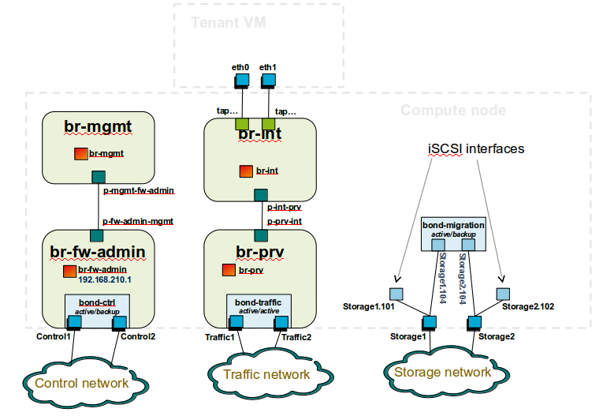

Networking
-----------

Test-bed network

* 24 or 48 Port TOR Switch
* NICS - 1GE, 10GE - per server can be on-board or PCI-e
* Connectivity for each data/control network is through a
separate NIC. This simplifies Switch Management however
requires more NICs on the server and also more switch ports
* Lights-out network can share with Admin/Management

Network Interfaces

* Option I: 4x1G Control, 2x40G Data, 48 Port Switch

  * 1 x 1G for ILMI (Lights out Management )
  * 1 x 1G for Admin/PXE boot
  * 1 x 1G for control Plane connectivity
  * 1 x 1G for storage
  * 2 x 40G (or 10G) for data network (redundancy,
  NIC bonding, High bandwidth testing)

* Option II: 1x1G Control, 2x 40G (or 10G) Data, 24 Port Switch

  * Connectivity to networks is through VLANs on the
  Control NIC. Data NIC used for VNF traffic and storage
  traffic segmented through VLANs

* Option III: 2x1G Control, 2x10G Data, 2x40G Storage, 24 Port Switch

  * Data NIC used for VNF traffic, storage NIC used for
  control plane and Storage segmented through VLANs
  (separate host traffic from VNF)
  * 1 x 1G for IPMI
  * 1 x 1G for Admin/PXE boot
  * 2 x 10G for control plane connectivity/Storage
  * 2 x 40G (or 10G) for data network

Documented configuration to include:
- Subnet, VLANs (may be constrained by existing lab setups or rules)
- IPs
- Types of NW - lights-out, public, private, admin, storage
- May be special NW requirements for performance related projects
- Default gateways

ontroller node bridge topology overview

.. image:: ../images/bridge1.png

compute node bridge topology overview

Architecture
-------------

** Network Diagram **

The Pharos architecture may be described as follow:
Figure 1: Standard Deployment Environment

.. image:: ../images/opnfv-pharos-diagram-v01.jpg

Figure 1: Standard Deployment Environment

Sample Network Drawings
-----------------------

Files for documenting lab network layout.
These were contributed as Visio VSDX format compressed as a ZIP
file. Here is a sample of what the visio looks like.

Download the visio zip file here:
`opnfv-example-lab-diagram.vsdx.zip
<https://wiki.opnfv.org/_media/opnfv-example-lab-diagram.vsdx.zip>`_

.. image:: ../images/opnfv-example-lab-diagram.png

